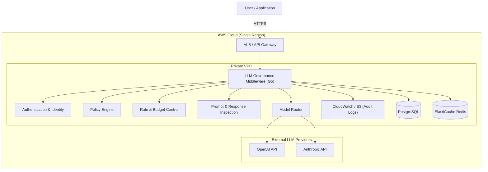

# Architecture & Implementation Strategy: LLM Control Plane

**Based on Project Requirements and Reference Implementation (tsum-app)**

## 1. Executive Summary

This document outlines the technical approach for the **LLM Control Plane** MVP. While the original PRD described a Kubernetes (EKS) architecture, we are adopting a **Serverless Architecture** (AWS Lambda + API Gateway) for the MVP. This aligns with the reference project (`tsum-app`) and offers lower operational overhead, cost-efficiency for initial scale, and a simpler "pay-per-use" model.

**Adoption Mode**: Single-Tenant (initially), centralized gateway.

## 2. System Architecture (Serverless MVP)

### 2.1 High-Level Stack

| Component         | Technology              | Role                                                    |
| ----------------- | ----------------------- | ------------------------------------------------------- |
| **Frontend**      | React + Vite + Tailwind | Administrative Dashboard & User UI                      |
| **Hosting**       | AWS S3 + CloudFront     | Static site hosting with global CDN                     |
| **Compute**       | AWS Lambda (Go)         | Stateless request processing, policy enforcement        |
| **API Layer**     | AWS API Gateway         | REST API entry point, request validation, throttling    |
| **Auth**          | AWS Cognito             | User Identity (User Pools) & Machine Auth (App Clients) |
| **Database**      | AWS RDS (PostgreSQL)    | Structured data (Orgs, Policies, Logs)                  |
| **Cache**         | AWS ElastiCache (Redis) | Rate limiting counters, session cache                   |
| **Infra as Code** | Terraform / CDK         | Provisioning all AWS resources                          |
| **CI/CD**         | GitHub Actions          | Automated build, test, and deploy                       |

### 2.2 Architecture Diagram



## 3. Useful Patterns from Reference Project (`tsum-app`)

We will adopt the following successful patterns from `tsum-app` to accelerate development:

### 3.1 Project Structure (Monorepo)

```text
llm-control-plane/
├── backend/          # Go source code (Lambda handlers + Core logic)
│   ├── cmd/          # Main entrypoints
│   ├── internal/     # Private application code
│   └── go.mod        # Go module definition
├── frontend/         # React application
│   ├── src/          # UI Source
│   └── package.json  # Dependencies
├── infra/            # IaC definitions (Terraform/CDK)
├── make/             # Modular Makefile definitions
├── .github/          # CI/CD Workflows
└── Makefile          # Master makefile for orchestration
```

### 3.2 Development Workflow (`Makefile`)

- **`make install`**: Installs both Go and Node.js dependencies.
- **`make dev`**: Starts the local environment:
  - Spins up **PostgreSQL** in Docker (mimicking RDS).
  - Starts **Redis** in Docker (mimicking ElastiCache).
  - Runs the **Go Backend** locally (listening on port 3000).
  - Runs the **Frontend** (Vite) locally (listening on port 8000).
- **Database Management**: `make db-up`, `make migrate-up` for schema management.

### 3.3 Security & Configuration

- **Secrets**: Use `.env` files for local development (gitignored), managed via 1Password or AWS Secrets Manager in production.
- **HTTPS**: Use self-signed certificates for local `https://localhost` development to mirror production security standards.

## 4. Detailed Service Implementation

### 4.1 Backend (AWS Lambda + Go)

- **Runtime**: Go 1.x (provided.al2023).
- **Framework**: AWS Lambda Go SDK + lightweight router (e.g., `chi` or standard `http.ServeMux` adapted for Lambda Proxy Integration).
- **Responsibility**:
  1.  Parse API Gateway events.
  2.  **Middleware Chain**:
      - Context extraction (User/Tenant ID).
      - **Policy Engine**: Check Redis for rate limits.
      - **Prompt Guard**: PII/Injection checks.
  3.  **Model Routing**: Select provider (OpenAI/Azure).
  4.  **Execution**: Call provider API.
  5.  **Audit**: Async write to RDS/CloudWatch.

### 4.2 Authentication (Cognito)

- **User Pools**: Manage human users (Admins, Auditors).
  - Enforce MFA.
  - Federation with corporate IdP (SAML/OIDC) if needed.
- **App Clients**: For application-to-API authentication (Client Credentials flow or API Keys managed by API Gateway).

### 4.3 Database (RDS PostgreSQL)

- Same schema as defined in PRD (Organizations, Applications, Users, RequestLogs).
- **Access**: Lambda accesses RDS via RDS Proxy (optional but recommended for Lambda connection pooling) or direct connection with strict connection lifetime management.

## 5. Deployment & Environments

### 5.1 Environment Strategy

- **Local**: Docker Compose for stateful services (Postgres, Redis), local process for stateless (Go, Node).
- **Dev**: AWS Account A. Deploys on push to `develop`.
- **Prod**: AWS Account B. Deploys on release tags.

### 5.2 CI/CD (GitHub Actions)

We will reuse the `tsum-app` workflow structure:

1.  **PR Check**:
    - Backend: `go test`, `golangci-lint`.
    - Frontend: `pnpm test`, `pnpm lint`.
2.  **Deploy (Main/Tag)**:
    - **Infra**: `terraform apply` to provision RDS, Redis, Cognito, API Gateway.
    - **Backend**: `go build` -> Zip -> Update Lambda Code.
    - **Frontend**: `pnpm build` -> Sync to S3 bucket -> Invalidate CloudFront.

## 6. Getting Started Guide (Draft)

1.  **Prerequisites**:
    - Go 1.21+
    - Node.js 20+ & pnpm
    - Docker Desktop / OrbStack
    - AWS CLI v2

2.  **Setup**:
    ```bash
    git clone <repo>
    cd llm-control-plane
    make install
    cp backend/.env.example backend/.env
    make dev
    ```

## 7. Next Steps

1.  **Initialize Repository Structure**: Create `backend`, `frontend`, `infra` folders.
2.  **Set up Makefile**: Port the modular Makefile system from `tsum-app`.
3.  **Scaffold Backend**: Initialize Go module and basic Lambda handler.
4.  **Scaffold Infra**: Set up Terraform/CDK state for "Dev" environment.
