# TSum Backend Architecture: Deep Technical Analysis

**Document Version:** 1.0  
**Last Updated:** February 6, 2026  
**Author:** Technical Architecture Review

---

## Executive Summary

The TSum backend is a **modular monolith** with **multi-tenant database isolation** built on Go, designed to run in **dual-mode** (AWS Lambda + local HTTPS server). It implements a **database-per-tenant SaaS bridge architecture** using PostgreSQL (AWS Aurora), with domain-driven design patterns and comprehensive AWS service integration.

**Key Architecture Highlights:**
- **Runtime Flexibility**: Single codebase supports both Lambda (production) and local development server
- **Multi-Tenant Isolation**: Database-per-tenant model with connection pooling and JWT-based tenant routing
- **Domain-Driven Structure**: Internal packages organized by business domains (inrush, testsheets, reports, etc.)
- **AWS-Native**: Deep integration with Lambda, Aurora RDS, S3, SES, Cognito, Secrets Manager, STS
- **Observability**: Datadog APM tracing for distributed tracing across Lambda, PostgreSQL, S3, and HTTP

---

## 1. System Architecture Overview

### 1.1 Architecture Pattern Classification

**Pattern:** Modular Monolith with Multi-Tenant Data Isolation

**Justification:**
- **Not Microservices**: Single deployable unit, shared runtime, no inter-service communication
- **Not Traditional Monolith**: Clear domain boundaries, dependency injection, clean interfaces
- **Modular Monolith**: Domain-specific packages (`internal/inrush`, `internal/testsheets`) with isolated concerns
- **Multi-Tenant SaaS Bridge**: Database-per-tenant isolation with centralized control plane

### 1.2 Core Design Principles

1. **Dual Runtime Support**: Same codebase runs as Lambda function or local HTTPS server
2. **Tenant Isolation**: Each tenant gets dedicated PostgreSQL database + S3 prefix
3. **Domain Boundaries**: Business logic organized by domain (sites/areas/assets, test sheets, reports)
4. **AWS-Native Operations**: Leverages managed AWS services for scalability and reliability
5. **Observability-First**: Datadog APM instrumentation at every layer (HTTP, DB, S3, AWS SDK)

### 1.3 High-Level Architecture Diagram

```mermaid
graph LR
    %% =======================
    %% Entry Points
    %% =======================
    subgraph Entry["Entry Points"]
        Lambda[AWS Lambda<br/>API Gateway / Async Events]
        LocalServer[Local HTTPS Server<br/>Dev & Debug]
    end

    %% =======================
    %% Core Application
    %% =======================
    subgraph App["Core Application (Go Modular Monolith)"]
        Main[Bootstrap & DI<br/>Config · Logging · Wiring]

        subgraph HTTP["HTTP Layer"]
            Router[Chi Router<br/>Route Mapping]
            Middleware[Auth & Tenant Middleware<br/>JWT Validation · Tenant Context]
        end

        DomainAPI[Domain Dispatch<br/>Command / Query Routing]

        subgraph Domains["Domain Services"]
            Inrush[Inrush<br/>Sites · Areas · Assets]
            TestSheets[Test Sheets<br/>Templates · Results]
            Reports[Reports<br/>PDF Generation]
            Formulas[Formulas<br/>Calculation Engine]
            Invitation[Invitation<br/>User Onboarding]
            Admin[Admin<br/>Tenant & User Mgmt]
        end
    end

    %% =======================
    %% Data Layer
    %% =======================
    subgraph Data["Data Layer (Database-per-Tenant)"]
        TenantMgr[Tenant Connection Manager<br/>Tenant → DB Mapping · Pooling]

        ControlDB[(Control Plane DB<br/>Tenants · Users · Invitations)]

        TenantDB[(Tenant Database<br/>Isolated per Tenant)]
    end

    %% =======================
    %% AWS Services
    %% =======================
    subgraph AWS["AWS Managed Services"]
        Cognito[Cognito<br/>JWT Issuer / IdP]
        S3[S3<br/>Tenant-Scoped Storage]
        SES[SES<br/>Transactional Email]
        SecretsManager[Secrets Manager<br/>DB Credentials]
        STS[STS<br/>Temporary AWS Access]
    end

    %% =======================
    %% Observability
    %% =======================
    Datadog[Datadog APM<br/>Tracing · Metrics · Logs]

    %% =======================
    %% Flow
    %% =======================
    Lambda --> Main
    LocalServer --> Main

    Main --> Router --> Middleware --> DomainAPI

    DomainAPI --> Inrush
    DomainAPI --> TestSheets
    DomainAPI --> Reports
    DomainAPI --> Formulas
    DomainAPI --> Invitation
    DomainAPI --> Admin

    Inrush --> TenantMgr
    TestSheets --> TenantMgr
    Reports --> TenantMgr
    Formulas --> TenantMgr
    Admin --> TenantMgr

    Invitation --> ControlDB
    TenantMgr --> ControlDB
    TenantMgr --> TenantDB

    %% =======================
    %% Integrations
    %% =======================
    Cognito -.->|Issues JWT| Middleware
    Domains --> S3
    Invitation --> SES
    Main --> SecretsManager
    Router --> STS

    %% =======================
    %% Observability
    %% =======================
    App -.-> Datadog
    Data -.-> Datadog
    S3 -.-> Datadog
```


---

## 2. Component Breakdown

### 2.1 Runtime & Entry Points

#### **Component: Lambda Handler (`lambda.go`)**

**Responsibilities:**
- Handle AWS Lambda invocations (API Gateway v1/v2, Function URL)
- Route HTTP requests to Chi router
- Process background events (migrations, seeders, database reset, scheduled notifications)
- Initialize Datadog APM tracing via Lambda Extension

**Runtime Model:** Serverless (AWS Lambda)

**Key Logic:**
```go
// Event type detection and routing
func handleLambdaUnifiedEvent(deps *app.Dependencies, event interface{}) {
    // EventBridge events (type: "scheduled-notification", "user-migration", "database-seeder")
    if eventType == "scheduled-notification" -> handleLambdaEventBridgeCallback
    if eventType == "user-migration" -> handleLambdaUserMigrationEvent (runs migrations)
    if eventType == "database-seeder" -> handleLambdaSeederEvent (seeds data)
    if eventType == "asset-details-seeder" -> handleLambdaAssetDetailsSeederEvent
    if eventType == "database-reset" -> handleLambdaDatabaseResetEvent (DANGER: drops all tables)
    
    // HTTP events (API Gateway, Lambda Function URL)
    -> createHTTPRouter -> process HTTP request
}
```

**Design Notes:**
- **Datadog Integration**: Automatic instrumentation via `ddlambda.WrapFunction`
- **Event Flexibility**: Supports both HTTP (API Gateway/Function URL) and async (EventBridge) invocations
- **Migration Safety**: Migrations run on-demand via EventBridge events, not on every Lambda cold start

---

#### **Component: Local Server (`server.go`)**

**Responsibilities:**
- Run HTTPS server for local development on `:3000`
- Load TLS certificates from `../certs/`
- Initialize OpenTelemetry tracing for Rerun (local observability)

**Runtime Model:** Long-running HTTP server (local development only)

**Key Features:**
- **Secure TLS**: TLS 1.2/1.3, strong cipher suites (ECDHE, RSA)
- **Rerun Tracing**: OpenTelemetry instrumentation for local debugging
- **Hot Reload**: Developers can use `air` for auto-reload during development

---

#### **Component: Main Entry (`main.go`)**

**Responsibilities:**
- Parse command-line arguments (`dev`, `migrate-up`, `seed-asset-details`)
- Load `.env` file for local development
- Create `Config` and `Dependencies` via dependency injection
- Route to Lambda or local server based on arguments

**Key Functions:**
- `createDependencies()`: Initializes DB, S3 FileService, SES EmailService, TenantConnectionManager
- Command handlers: `migrate-up`, `seed-asset-details`, `dev`

---

### 2.2 HTTP Routing & Middleware

#### **Component: Router (`routes/routes.go`)**

**Responsibilities:**
- Define all HTTP routes using Chi router
- Apply middleware stack (auth, CORS, tenant extraction, logging, error handling)
- Support dual-mode routing (single-tenant vs multi-tenant)
- Integrate with `go-user-management` library for OAuth/JWT handling

**Middleware Stack (Applied in Order):**
1. **RequestID**: Generate unique request ID
2. **RealIP**: Extract client IP from headers
3. **RerunRunIDExtractor**: Extract Rerun session ID for tracing
4. **ErrorHandler**: Catch panics and return 500
5. **AccessLoggerChi**: Log HTTP requests
6. **CORS**: Allow frontend + tenant subdomains
7. **RequireAuthMiddleware** (protected routes): Validate JWT from Cognito
8. **TenantMiddlewareWithDB** (multi-tenant routes): Extract tenant context from JWT
9. **DatadogTenantMiddleware** (production): Add tenant tags to Datadog spans
10. **RequireRoleMiddleware** (admin routes): Verify user role (e.g., "superadmin")

**Route Groups:**

| Route Group | Authentication | Tenant Context | Description |
|------------|---------------|----------------|-------------|
| `/` | Public | No | Health check, root endpoint |
| `/api/auth/*` | Public | No | OAuth login, callback, profile, STS |
| `/api/inrush/*` | JWT Required (prod) | Yes | Sites, areas, assets, compliance |
| `/api/testsheets/*` | JWT Required (prod) | Yes | Test sheet templates, data |
| `/api/reports/*` | JWT Required (prod) | Yes | PDF report generation |
| `/api/files/*` | JWT Required | Yes | S3 presigned URLs (upload/download) |
| `/api/invitations/*` | Mixed | No | Invite users, accept invitations |
| `/api/admin/tenants/*` | JWT + Superadmin | No | Create/delete tenant databases |
| `/api/user-tenant/*` | JWT Required | No | Switch active tenant |

**Multi-Tenant Routing Logic:**
```go
isMultiTenantMode := deps.Config.MultiTenant.Enabled

if isMultiTenantMode {
    // Use TenantConnectionManager for database routing
    inrush.SetupRoutesWithTenantManager(r, deps.TenantConnections, deps.FileService)
} else {
    // Use default database directly
    inrush.SetupRoutes(r, deps.DB, deps.FileService)
}
```

---

### 2.3 Domain Services (Internal Packages)

The backend follows a **domain-driven design** with clear package boundaries:

#### **Domain: Inrush (`internal/inrush/`)**

**Responsibility:** Core business entities (Sites, Areas, Assets, Asset Classes, Files, Compliance)

**Components:**
- `models.go`: Domain entities (Site, Area, Asset, AssetClass, File, Contact)
- `repository.go`: Database queries (PostgreSQL)
- `handler.go`: HTTP handlers (single-tenant mode)
- `handler_tenant.go`: HTTP handlers (multi-tenant mode using TenantConnectionManager)
- `routes.go`: Route registration

**Key Features:**
- **Soft Delete**: Assets support `deleted_at` timestamp
- **Slugification**: Sites and areas have URL-friendly slugs
- **Foreign Key Validation**: PostgreSQL enforces referential integrity
- **Compliance Tracking**: Calculate compliance status per site/area

**Handler Pattern:**
```go
// Single-tenant handler (uses default DB)
func HandleGetSites(db *sql.DB) http.HandlerFunc {
    return func(w http.ResponseWriter, r *http.Request) {
        sites, err := GetSites(r.Context(), db)
        // ...
    }
}

// Multi-tenant handler (uses TenantConnectionManager)
func HandleGetSitesTenant(tm *db.TenantConnectionManager) http.HandlerFunc {
    return func(w http.ResponseWriter, r *http.Request) {
        db, err := tm.GetConnectionFromContext(r.Context())
        sites, err := GetSites(r.Context(), db)
        // ...
    }
}
```

---

#### **Domain: Test Sheets (`internal/testsheets/`)**

**Responsibility:** Test sheet templates, test sheet data, PDF generation, file attachments

**Components:**
- `models.go`: TestSheet, TestSheetTemplate, TemplateData (JSON)
- `repository.go`: CRUD operations for test sheets
- `handler.go`: HTTP handlers (single/multi-tenant)
- `file_http.go`: Test sheet file attachments
- `routes.go`: Route registration

**Key Features:**
- **Template-Based Data**: Test sheets follow JSON schema defined by templates
- **Dynamic Validation**: Template schemas validated at runtime
- **File Attachments**: Test sheets can have multiple file attachments (S3)

---

#### **Domain: Reports (`internal/reports/`)**

**Responsibility:** PDF report generation from test sheet data

**Components:**
- PDF generation handlers (likely using external library or template engine)
- Report templates
- S3 upload for generated PDFs

---

#### **Domain: Formulas (`internal/formulas/`)**

**Responsibility:** Formula definitions, calculations, formula bindings (Go ↔ TypeScript codegen)

**Components:**
- `repository.go`: Formula CRUD
- Formula execution engine
- Bindings codegen (generates TypeScript types from Go structs)

---

#### **Domain: Invitations (`internal/invitation/`)**

**Responsibility:** User invitation system for tenant onboarding

**Components:**
- `models.go`: Invitation entity (email, token, role, status, expires_at)
- `repository.go`: CRUD for invitations
- `handler.go`: Create invitation, accept invitation, list invitations
- `routes.go`: Public + protected routes

**Key Features:**
- **Email Integration**: Sends SES emails via `EmailService`
- **Token-Based**: Secure invitation tokens with expiration
- **Role Assignment**: Invitations specify user role in tenant

---

#### **Domain: Admin (`internal/admin/`)**

**Responsibility:** Tenant management (control plane for TSum superadmins)

**Components:**
- Tenant creation (creates new PostgreSQL database)
- Tenant deletion (drops tenant database)
- Tenant listing

**Security:** Requires `superadmin` role via `RequireRoleMiddleware`

---

### 2.4 Data Layer Components

#### **Component: TenantConnectionManager (`db/tenant_connection.go`)**

**Responsibility:** Manage database connections for multi-tenant architecture

**Key Features:**
1. **Database-per-Tenant Isolation**: Each tenant gets a dedicated PostgreSQL database
2. **Connection Pooling**: Cached connections per tenant database (thread-safe with `sync.RWMutex`)
3. **Dynamic URI Construction**: Modifies base connection string to target tenant database
4. **Administrative Operations**: Create/drop tenant databases via control plane

**Database Naming Convention:**
```
{serviceProviderId}_{tenantId}
Example: inrush_bp, inrush_acme
```

**Connection Flow:**


**Trade-offs:**
- ✅ **Strong Isolation**: Tenant data cannot leak across databases
- ✅ **Schema Independence**: Each tenant can have different schema versions
- ❌ **Connection Overhead**: More database connections required
- ❌ **Migration Complexity**: Must run migrations for each tenant database

---

#### **Component: Database Connection (`db/database.go`)**

**Responsibilities:**
- Open PostgreSQL connection using `pgx` driver
- Configure connection pool (max open/idle connections)
- Register Datadog-traced driver for APM

**Datadog Tracing:**
```go
if os.Getenv("DD_SERVICE") != "" {
    sqltrace.Register("pgx-traced", stdlib.GetDefaultDriver(),
        sqltrace.WithService("tsum-postgres"),
        sqltrace.WithAnalytics(true),
        sqltrace.WithDBStats(),
    )
    driverName = "pgx-traced"
}
```

**Connection Pool Settings:**
- Max Open Connections: 25
- Max Idle Connections: 5

---

### 2.5 File Storage Component

#### **Component: S3Repository (`go-file-storage/s3_repository.go`)**

**Responsibility:** Interact with AWS S3 for file upload/download

**Key Features:**
1. **Presigned URLs**: Generate temporary upload/download URLs (15-minute expiry)
2. **Tenant-Scoped Prefixes**: Files stored under `{serviceProviderId}/{category}/{fileID}`
3. **STS Credential Support**: Support client-side presigned URL generation with temporary credentials
4. **Datadog Tracing**: Instrument S3 operations via `awstrace.AppendMiddleware`

**S3 Key Structure:**
```
{serviceProviderId}/{category}/{fileID}

Examples:
- inrush/files/uuid-123.pdf
- inrush/images/uuid-456.jpg
- bp/test-sheets/uuid-789.xlsx
```

**Categories:** `files`, `images`, `test-sheets`, `reports`

**Presigned URL Flow:**


---

### 2.6 Authentication & Authorization Components

#### **Component: Cognito Client (`internal/cognito/client.go`)**

**Responsibility:** Interact with AWS Cognito for JWT validation

**Key Features:**
- JWT token extraction from `Authorization` header
- JWT validation using Cognito JWKS (JSON Web Key Set)
- Claims extraction (email, username, tenant context, role)

**JWT Claims Structure:**
```json
{
  "sub": "user-uuid",
  "email": "user@example.com",
  "cognito:username": "user@example.com",
  "custom:userRole": "admin",
  "custom:serviceProviderId": "inrush",
  "custom:tenantId": "bp",
  "custom:apiKey": "secret-api-key"
}
```

**Tenant Context Extraction:**
```go
type TenantClaims struct {
    Email             string `json:"email"`
    Username          string `json:"cognito:username"`
    UserRole          string `json:"custom:userRole"`
    ServiceProviderID string `json:"custom:serviceProviderId"`
    TenantID          string `json:"custom:tenantId"`
    APIKey            string `json:"custom:apiKey"`
}

func ExtractTenantClaimsFromRequest(r *http.Request) (*TenantClaims, error) {
    // Extract JWT from Authorization header
    // Validate JWT signature using Cognito JWKS
    // Parse claims into TenantClaims struct
}
```

---

#### **Component: STS Integration (`go-user-management` library)**

**Responsibility:** Exchange Cognito JWT for temporary AWS credentials

**Flow:**


**Use Case:** Client-side S3 uploads without proxying through backend

---

### 2.7 Email Service Component

#### **Component: Email Service (`internal/email/service.go`)**

**Responsibility:** Send transactional emails via AWS SES

**Supported Email Types:**
- **Invitation Emails**: Send user invitations with acceptance link

**Configuration:**
- Region: `AWS_SES_REGION` (default: `us-east-1`)
- From Email: `SES_FROM_EMAIL`
- AWS Profile: `SES_AWS_PROFILE` (optional, for local development)

**Template Structure:**
- HTML email template (invitation, role, tenant info)
- Plain text fallback

---

## 3. AWS Infrastructure Usage

### 3.1 AWS Services Inventory

| Service | Usage | Configuration | Trade-offs |
|---------|-------|---------------|------------|
| **Lambda** | Serverless API execution | Memory: 512MB-1024MB<br/>Timeout: 30s<br/>Concurrency: Provisioned | ✅ Auto-scaling<br/>✅ No server management<br/>❌ Cold start latency<br/>❌ 15-min max timeout |
| **Aurora RDS (PostgreSQL)** | Relational database (multi-tenant) | Serverless v2<br/>Min capacity: 0.5 ACU<br/>Max capacity: 2 ACU | ✅ Auto-scaling<br/>✅ High availability<br/>❌ Cost for idle time<br/>❌ Slower than provisioned |
| **API Gateway** | HTTP routing to Lambda | REST API or HTTP API<br/>CORS enabled | ✅ Managed<br/>✅ Rate limiting<br/>❌ Additional latency<br/>❌ Cost per request |
| **S3** | File storage (images, PDFs, test sheets) | Standard storage class<br/>Lifecycle policies | ✅ Unlimited storage<br/>✅ 99.999999999% durability<br/>❌ Eventual consistency for overwrites |
| **Cognito** | User authentication, JWT issuer | User Pool + App Client<br/>OAuth 2.0 flows | ✅ Managed auth<br/>✅ JWT validation<br/>❌ Limited customization<br/>❌ User export restrictions |
| **STS** | Temporary AWS credentials | AssumeRoleWithWebIdentity | ✅ Client-side S3 access<br/>✅ Fine-grained permissions<br/>❌ Credential refresh complexity |
| **SES** | Transactional email | Sandbox or Production mode | ✅ Reliable delivery<br/>✅ Low cost<br/>❌ Email verification required<br/>❌ Sending limits |
| **Secrets Manager** | Database credentials | Aurora auto-rotation | ✅ Secure credential storage<br/>✅ Rotation support<br/>❌ Cost per secret<br/>❌ API call latency |
| **EventBridge Scheduler** | Scheduled events (migrations, seeders) | Cron-based triggers | ✅ Serverless scheduling<br/>✅ Pay per invocation<br/>❌ Minimum 1-minute interval |
| **CloudWatch Logs** | Application logs | Log retention: 7 days | ✅ Integrated with Lambda<br/>❌ Cost for large log volumes |
| **Datadog APM** | Distributed tracing, metrics | Lambda Extension<br/>Agent on EC2 (if used) | ✅ End-to-end visibility<br/>✅ Custom metrics<br/>❌ Additional cost<br/>❌ Performance overhead |

---

### 3.2 AWS Infrastructure Diagram

```mermaid
graph LR
    %% =======================
    %% Client
    %% =======================
    subgraph Client["Client"]
        Browser[Browser / Mobile App]
    end

    %% =======================
    %% AWS Cloud
    %% =======================
    subgraph AWS["AWS Cloud"]
        %% API Layer
        subgraph API["API Layer"]
            APIGateway[API Gateway<br/>HTTP / REST]
            LambdaFunction[Lambda<br/>Go Runtime]
        end

        %% Auth
        subgraph Auth["Authentication"]
            Cognito[Cognito<br/>JWT Issuer]
            STS[STS<br/>Temporary AWS Access]
        end

        %% Data
        subgraph Data["Data Stores"]
            Aurora[Aurora Serverless v2<br/>PostgreSQL]
            S3Bucket[S3<br/>Files · Images · PDFs]
        end

        %% Supporting
        subgraph Support["Supporting Services"]
            SecretsManager[Secrets Manager<br/>DB Credentials]
            SES[SES<br/>Emails]
        end

        %% Observability
        subgraph Obs["Observability"]
            CloudWatch[CloudWatch Logs]
            Datadog[Datadog APM]
        end
    end

    %% =======================
    %% Client Flows
    %% =======================
    Browser -->|HTTPS API| APIGateway
    Browser -->|OAuth Login| Cognito
    Cognito -->|JWT| Browser
    Browser -.->|Direct Upload / Download| S3Bucket

    %% =======================
    %% API Execution Flow
    %% =======================
    APIGateway --> LambdaFunction

    %% =======================
    %% Lambda Integrations
    %% =======================
    LambdaFunction -->|Read / Write| Aurora
    LambdaFunction -->|Presigned URLs| S3Bucket
    LambdaFunction -->|Send Emails| SES
    LambdaFunction -->|Fetch Secrets| SecretsManager
    LambdaFunction -->|Assume Role| STS

    %% =======================
    %% Observability
    %% =======================
    LambdaFunction -.-> CloudWatch
    LambdaFunction -.-> Datadog
``` 


---

### 3.3 Why Each AWS Service Was Chosen

#### **Lambda vs EC2**
- **Chosen:** Lambda
- **Why:** 
  - Auto-scaling (0 to 1000s of concurrent executions)
  - No server management
  - Pay-per-request pricing (cost-effective for variable traffic)
- **Trade-offs:**
  - ❌ Cold starts (mitigated with provisioned concurrency)
  - ❌ 15-minute timeout limit (not an issue for API requests)

#### **Aurora Serverless v2 vs RDS Provisioned**
- **Chosen:** Aurora Serverless v2
- **Why:**
  - Auto-scaling based on load (0.5 ACU to 2 ACU)
  - Pay for actual usage (important for dev/sandbox environments)
  - Multi-AZ high availability
- **Trade-offs:**
  - ❌ Slower scaling compared to provisioned instances
  - ❌ Cost for idle capacity (min 0.5 ACU)

#### **S3 vs EFS**
- **Chosen:** S3
- **Why:**
  - Unlimited storage
  - 99.999999999% durability
  - Presigned URLs for direct client uploads (reduces Lambda bandwidth)
  - Lower cost for infrequent access (Intelligent Tiering)
- **Trade-offs:**
  - ❌ Not a file system (no POSIX operations)
  - ❌ Eventual consistency for overwrites

#### **Cognito vs Auth0/Okta**
- **Chosen:** Cognito
- **Why:**
  - Native AWS integration (no additional vendor lock-in)
  - JWT validation without external API calls
  - User pool federation (social logins, SAML)
  - Low cost (50,000 MAU free tier)
- **Trade-offs:**
  - ❌ Limited UI customization
  - ❌ User export requires lambda triggers

#### **STS AssumeRoleWithWebIdentity vs Backend Proxying**
- **Chosen:** STS
- **Why:**
  - Client-side S3 uploads (reduces Lambda bandwidth and cost)
  - Fine-grained IAM policies per tenant
  - Temporary credentials (auto-expire after 1 hour)
- **Trade-offs:**
  - ❌ Client-side credential management complexity
  - ❌ Cross-region latency for STS calls

---

### 3.4 Network Architecture

#### **Local Development:**
```
Browser (https://localhost:8000)
  ↓
Backend (https://localhost:3000)
  ↓ (DATABASE_URL)
PostgreSQL (localhost:5433)
```

#### **Production (AWS):**
```
Browser (https://app.tsum.io)
  ↓
CloudFront (CDN) → Frontend (S3 static site)
  ↓ (API calls)
API Gateway (https://api.tsum.io)
  ↓
Lambda Function (VPC: Private Subnets)
  ↓
Aurora RDS (VPC: Private Subnets, Multi-AZ)
```

**Security Groups:**
- Lambda → Aurora: Port 5432 (PostgreSQL)
- Lambda → Internet: Port 443 (HTTPS for S3, SES, STS)
- Aurora → Lambda: No inbound (one-way traffic)

---

### 4.2 Critical Operation: File Upload (S3 Presigned URL)

**Synchronous Path (Presigned URL Generation):**


**Execution Time Breakdown:**
- Presigned URL generation: 5-10ms (AWS SDK call)
- Client-side upload to S3: Variable (depends on file size and network)
- File metadata insert: 5-10ms (PostgreSQL)
- **Total (backend):** 10-20ms

**Trade-offs:**
- ✅ Reduced Lambda bandwidth (client uploads directly to S3)
- ✅ Lower Lambda cost (no proxy upload)
- ❌ Frontend complexity (handle presigned URL expiration)

---

**GitHub Actions Workflow Excerpt:**

```yaml
# .github/workflows/infra.yml

- name: Run Database Migrations
  run: |
    echo '{"type": "user-migration"}' > /tmp/migration-payload.json
    
    # Direct Lambda invocation (not EventBridge)
    RESPONSE=$(aws lambda invoke \
      --function-name ${{ steps.deploy.outputs.arn }} \
      --payload fileb:///tmp/migration-payload.json \
      --output json \
      /tmp/migration-response.json)
    
    # Check response
    STATUS_CODE=$(echo $RESPONSE | jq -r '.StatusCode')
    MIGRATION_RESULT=$(cat /tmp/migration-response.json | jq -r '.status')
    
    if [ "$MIGRATION_RESULT" != "success" ]; then
      echo "❌ Database migrations failed"
      exit 1
    fi

- name: Run Database Seeders
  run: |
    echo '{"type": "database-seeder"}' > /tmp/seeder-payload.json
    aws lambda invoke --function-name ${{ steps.deploy.outputs.arn }} ...

- name: Seed Asset Details Templates
  run: |
    echo '{"type": "asset-details-seeder"}' > /tmp/asset-details-payload.json
    aws lambda invoke --function-name ${{ steps.deploy.outputs.arn }} ...
```

**Deployment Trigger Flow:**

```
Developer Push to GitHub
  ↓
GitHub Actions Workflow (.github/workflows/infra.yml)
  ↓
Deploy Infrastructure (Aurora, S3, Cognito, Lambda)
  ↓
[Optional] Reset Database (SANDBOX ONLY)
  ├─ Create JSON: {"type": "database-reset"}
  ├─ aws lambda invoke --function-name <arn> --payload
  └─ Lambda drops all tables
  ↓
Run Migrations
  ├─ Create JSON: {"type": "user-migration"}
  ├─ aws lambda invoke --function-name <arn> --payload
  └─ Lambda runs all .up.sql migrations
  ↓
Run Seeders Architecture decisions should be re-evaluated as the system scales and requirements evolve
Build & Deploy Frontend
```

**Why Direct Invocation Instead of EventBridge?**

| Aspect | Direct Lambda Invocation (Current) | EventBridge (Future) |
|--------|-----------------------------------|----------------------|
| **Execution** | Synchronous (GitHub Actions waits) | Asynchronous (fire and forget) |
| **Error Handling** | Immediate feedback to workflow | Requires polling/SNS notification |
| **Deployment Flow** | Sequential (migrations → seeders) | Parallel (requires orchestration) |
| **Simplicity** | ✅ Simple (no additional AWS resources) | ❌ Complex (EventBridge + DLQ) |
| **Cost** | ✅ Free (Lambda invocation only) | ❌ $1/million events |
| **Use Case** | ✅ **Deployment pipelines** | ✅ **Scheduled jobs** |

**Step-by-Step: What Happens When You Push to GitHub**

1. **Developer Action:**
   ```bash
   git add .
   git commit -m "Add new feature"
   git push origin main  # or create a tag for production
   ```

2. **GitHub Triggers Workflow:**
   - `on-push.yml` → calls → `infra.yml` (reusable workflow)
   - Workflow runs on: `ubuntu-latest` runner
   - AWS credentials configured via OIDC (no long-lived keys)

3. **Infrastructure Deployment (Terraform via GitHub Actions):**
   ```
   ├─ Network (VPC, Subnets, Security Groups)
   ├─ S3 Bucket (with CORS for tenant-scoped uploads)
   ├─ Cognito (User Pool + App Client)
   ├─ Aurora PostgreSQL Serverless v2
   │  ├─ Database: {instance_name}db
   │  ├─ Credentials stored in Secrets Manager
   │  └─ Min: 0.5 ACU, Max: 2 ACU
   └─ Lambda Function
      ├─ Memory: 256 MB
      ├─ Timeout: 15 minutes
      ├─ VPC: Enabled (private subnets)
      ├─ Environment Variables: ~15 vars (S3, Aurora, Cognito)
      └─ Datadog Layer: Attached if DD_API_KEY provided
   ```

4. **[Optional] Database Reset (Sandbox Only):**
   ```bash
   # GitHub Actions creates payload
   echo '{"type": "database-reset"}' > /tmp/reset-payload.json
   
   # Invokes Lambda directly (NOT EventBridge)
   aws lambda invoke \
     --function-name arn:aws:lambda:us-east-1:123456:function:tsum-lambda \
     --payload fileb:///tmp/reset-payload.json \
     /tmp/reset-response.json
   
   # Lambda receives: {"type": "database-reset"}
   # Lambda executes: DROP SCHEMA public CASCADE; CREATE SCHEMA public;
   # Lambda returns: {"status": "success", "message": "Database reset completed"}
   ```

5. **Database Migrations:**
   ```bash
   # GitHub Actions creates payload
   echo '{"type": "user-migration"}' > /tmp/migration-payload.json
   
   # Invokes Lambda
   aws lambda invoke --function-name <arn> --payload fileb:///tmp/migration-payload.json ...
   
   # Lambda detects event type and routes to handler
   handleLambdaUnifiedEvent() 
     → if eventType == "user-migration"
     → handleLambdaUserMigrationEvent()
     → migrations.NewPostgresMigrator(deps.DB)
     → migrator.RunMigrations()
     → Executes all *.up.sql files in backend/migrations/schema/
     → Returns: {"status": "success", "message": "All migrations completed successfully"}
   
   # GitHub Actions validates response
   if [ "$MIGRATION_RESULT" != "success" ]; then exit 1; fi
   ```

6. **Database Seeders:**
   ```bash
   # GitHub Actions creates payload
   echo '{"type": "database-seeder"}' > /tmp/seeder-payload.json
   
   # Invokes Lambda
   aws lambda invoke --function-name <arn> --payload fileb:///tmp/seeder-payload.json ...
   
   # Lambda routes to seeder handler
   handleLambdaSeederEvent()
     → seeders.NewSeeder(deps.DB)
     → seeder.RunSeeders()
     → Reads ENVIRONMENT env var (prod vs sandbox)
     → If prod: backend/seeders/prod/*.sql (minimal data)
     → If sandbox: backend/seeders/sandbox/*.sql (comprehensive test data)
     → Returns: {"status": "success"}
   ```

7. **Asset Details Templates:**
   ```bash
   # GitHub Actions creates payload
   echo '{"type": "asset-details-seeder"}' > /tmp/asset-details-payload.json
   
   # Invokes Lambda
   handleLambdaAssetDetailsSeederEvent()
     → assetdetails.SeedAssetDetailsTemplates(deps.DB, AssetDetailsJSONFS)
     → Reads embedded JSON files from backend/asset-details-json/
     → Inserts into asset_details_templates table
   ```

### 4.4 Synchronous vs Asynchronous Paths

| Operation | Path Type | Trigger | Max Duration | Retry Policy |
|-----------|-----------|---------|--------------|--------------|
| API Requests (GET/POST/PUT/DELETE) | Synchronous | HTTP | 30s (API Gateway) | Frontend retry |
| Database Migrations | Asynchronous | EventBridge | 15 min (Lambda) | EventBridge retry (3x) |
| Database Seeders | Asynchronous | EventBridge | 15 min | EventBridge retry (3x) |
| Scheduled Notifications | Asynchronous | EventBridge Scheduler | 15 min | Manual retry |

---

## 5. Trade-offs & Design Decisions

### 5.1 Dual Runtime Support (Lambda + Local Server)

**Decision:** Support both Lambda and local HTTPS server from single codebase

**Trade-offs:**

| Aspect | Lambda (Production) | Local Server (Development) |
|--------|---------------------|----------------------------|
| **Pros** | ✅ Auto-scaling<br/>✅ No server management<br/>✅ Pay-per-request | ✅ Fast iteration<br/>✅ Debugger support<br/>✅ No AWS API calls |
| **Cons** | ❌ Cold start latency<br/>❌ 15-min timeout<br/>❌ VPC config complexity | ❌ Manual scaling<br/>❌ Self-signed certs<br/>❌ Requires local PostgreSQL |

**Implementation Cost:**
- Requires conditional initialization (e.g., Datadog vs OpenTelemetry)
- Requires environment variable management (`.env` vs Lambda env vars)

**Verdict:** ✅ **Worth the complexity** - Enables fast local development without AWS dependencies

---

### 5.2 Database-per-Tenant vs Shared Schema

**Decision:** Database-per-tenant (each tenant gets dedicated PostgreSQL database)

**Alternatives:**
1. **Shared Schema + Tenant ID column**: All tenants share one database
2. **Schema-per-tenant**: One database, one schema per tenant

**Comparison:**

| Aspect | Database-per-Tenant (Chosen) | Shared Schema | Schema-per-Tenant |
|--------|------------------------------|---------------|-------------------|
| **Data Isolation** | ✅✅ Strongest (physical separation) | ❌ Weak (logical separation) | ✅ Strong (schema-level) |
| **Compliance** | ✅ Easier GDPR compliance (delete DB) | ❌ Complex data deletion | ✅ Moderate |
| **Migration Complexity** | ❌❌ Must migrate all tenant DBs | ✅ Single migration | ❌ Migrate all schemas |
| **Connection Pool** | ❌ More connections required | ✅ Shared pool | ❌ More connections |
| **Schema Flexibility** | ✅✅ Independent schema per tenant | ❌ Shared schema | ✅ Independent schema |
| **Cost** | ❌ Higher (more databases) | ✅ Lowest | ❌ Moderate |

**Verdict:** ✅ **Database-per-tenant is correct choice** for:
- Strong regulatory requirements (GDPR, HIPAA)
- Customers who demand data isolation
- Independent schema evolution per tenant

**Cost Mitigation:**
- Use Aurora Serverless v2 (scales to 0 when idle)
- Shared Aurora cluster (separate DBs, shared compute)

## 7. Code Quality & Maintainability

### 7.1 Code Organization Assessment

**✅ Strengths:**
1. **Clear Domain Boundaries**: Each domain has dedicated package (`internal/inrush`, `internal/testsheets`)
2. **Consistent Handler Pattern**: All handlers follow `HandleXXX(db *sql.DB) http.HandlerFunc`
3. **Dependency Injection**: `Dependencies` struct cleanly wires components
4. **Repository Pattern**: Database queries isolated in `repository.go` files

**❌ Weaknesses:**
1. **Duplicated Handler Logic**: Separate handlers for single-tenant vs multi-tenant mode
2. **No Service Layer**: Business logic mixed in handlers (should be in separate service layer)
3. **Tight Coupling to `sql.DB`**: Handlers depend directly on `*sql.DB` (hard to mock for testing)
4. **Missing Error Wrapping**: Errors not consistently wrapped with context

---

### 7.2 Code Duplication Issues

#### **Issue 1: Dual Handler Functions**

**Location:** `internal/inrush/handler.go` vs `internal/inrush/handler_tenant.go`

**Problem:**
```go
// Single-tenant version
func HandleGetSites(db *sql.DB) http.HandlerFunc {
    return func(w http.ResponseWriter, r *http.Request) {
        sites, err := GetSites(r.Context(), db)
        // ... 50 lines of logic
    }
}

// Multi-tenant version (duplicated logic)
func HandleGetSitesTenant(tm *db.TenantConnectionManager) http.HandlerFunc {
    return func(w http.ResponseWriter, r *http.Request) {
        db, err := tm.GetConnectionFromContext(r.Context())
        sites, err := GetSites(r.Context(), db)
        // ... 50 lines of identical logic
    }
}
```

**Impact:**
- 2x code maintenance (bug fixes must be applied twice)
- Inconsistent error handling across handlers
- Test coverage gaps (tests only cover one variant)

**Refactor Proposal:**
```go
// Unified handler with database resolver interface
type DBResolver interface {
    GetDB(ctx context.Context) (*sql.DB, error)
}

func HandleGetSites(dbResolver DBResolver) http.HandlerFunc {
    return func(w http.ResponseWriter, r *http.Request) {
        db, err := dbResolver.GetDB(r.Context())
        sites, err := GetSites(r.Context(), db)
        // ... single implementation
    }
}

// Adapters
type DefaultDBResolver struct { db *sql.DB }
func (r *DefaultDBResolver) GetDB(ctx context.Context) (*sql.DB, error) {
    return r.db, nil
}

type TenantDBResolver struct { tm *db.TenantConnectionManager }
func (r *TenantDBResolver) GetDB(ctx context.Context) (*sql.DB, error) {
    return r.tm.GetConnectionFromContext(ctx)
}
```

---

#### **Issue 2: Repeated Error Handling Patterns**

**Location:** Handlers across all domains

**Problem:**
```go
// Repeated 10+ times per handler
if err != nil {
    log.Printf("ERROR: Failed to get sites: %v", err)
    utils.WriteError(w, err.Error(), http.StatusInternalServerError)
    return
}
```

**Refactor Proposal:**
```go
// Centralized error handler middleware
func (h *Handler) handleError(w http.ResponseWriter, err error, context string) {
    log.Printf("ERROR [%s]: %v", context, err)
    
    // Map error types to HTTP status codes
    switch {
    case errors.Is(err, sql.ErrNoRows):
        utils.WriteError(w, "Not found", http.StatusNotFound)
    case isFKViolationError(err):
        utils.WriteError(w, "Invalid reference", http.StatusBadRequest)
    default:
        utils.WriteError(w, "Internal server error", http.StatusInternalServerError)
    }
}
```

---

### 7.3 Tight Coupling Analysis

#### **Coupling 1: Handlers → `*sql.DB`**

**Problem:**
```go
func HandleGetSites(db *sql.DB) http.HandlerFunc {
    // Handler directly depends on concrete *sql.DB type
}
```

**Impact:**
- **Hard to test**: Must spin up real PostgreSQL for unit tests
- **Hard to mock**: Cannot inject test database
- **Violates dependency inversion**: Handler depends on concrete implementation

**Refactor:**
```go
// Define interface at domain boundary
type SiteRepository interface {
    GetSites(ctx context.Context) ([]Site, error)
    GetSiteByID(ctx context.Context, id string) (*Site, error)
    // ...
}

// Handler depends on interface
func HandleGetSites(repo SiteRepository) http.HandlerFunc {
    return func(w http.ResponseWriter, r *http.Request) {
        sites, err := repo.GetSites(r.Context())
        // ...
    }
}

// Implementation
type PostgresSiteRepository struct {
    db *sql.DB
}

func (r *PostgresSiteRepository) GetSites(ctx context.Context) ([]Site, error) {
    // SQL queries here
}
```

---

#### **Coupling 2: Business Logic in Handlers**

**Problem:** Handlers contain business logic (should be in service layer)

**Example:**
```go
func HandleCreateSite(db *sql.DB) http.HandlerFunc {
    return func(w http.ResponseWriter, r *http.Request) {
        // Parse request
        var req CreateSiteRequest
        json.NewDecoder(r.Body).Decode(&req)
        
        // Validation logic (should be in service layer)
        if req.Name == "" {
            utils.WriteError(w, "Name required", http.StatusBadRequest)
            return
        }
        
        // Business logic (should be in service layer)
        slug := slugify(req.Name)
        
        // Database call
        site, err := CreateSite(r.Context(), db, req.Name, slug)
        // ...
    }
}
```

**Refactor:**
```go
// Service layer
type SiteService struct {
    repo SiteRepository
}

func (s *SiteService) CreateSite(ctx context.Context, req CreateSiteRequest) (*Site, error) {
    // Validation
    if err := req.Validate(); err != nil {
        return nil, err
    }
    
    // Business logic
    slug := slugify(req.Name)
    
    // Repository call
    return s.repo.CreateSite(ctx, req.Name, slug)
}

// Thin handler
func HandleCreateSite(svc *SiteService) http.HandlerFunc {
    return func(w http.ResponseWriter, r *http.Request) {
        var req CreateSiteRequest
        json.NewDecoder(r.Body).Decode(&req)
        
        site, err := svc.CreateSite(r.Context(), req)
        if err != nil {
            handleError(w, err)
            return
        }
        
        utils.WriteOK(w, site, "")
    }
}

---

## 8. Detailed Code Quality Issues & Required Refactoring (Linear Tickets)

This section provides an exhaustive analysis of code quality issues discovered in the TSum backend codebase, with specific file locations, impact analysis, and detailed refactoring instructions for each affected file.

---

### 8.1 Critical Issue: Massive Handler Duplication (Multi-Tenant Variants)

**Severity:** 🔴 **CRITICAL**  
**Impact:** ~800 lines of duplicated code  
**Effort:** 3-5 days  
**Priority:** P0 (Must fix)

#### Problem Description

The codebase maintains **dual handler implementations** for every endpoint: one for single-tenant mode and one for multi-tenant mode. This results in nearly 50% code duplication in the `internal/inrush/handler.go` file alone.

**Affected Files:**
- `backend/internal/inrush/handler.go` (1,572 lines, 46 handlers, 23 are `*Tenant` variants)
- `backend/internal/testsheets/handler.go` (~600 lines, multiple `*Tenant` variants)
- `backend/internal/reports/handler.go` (~200 lines, `*Tenant` variants)
- `backend/internal/formulas/handler.go` (~300 lines, `*Tenant` variants)
- `backend/internal/assetdetails/handler.go` (`*Tenant` variants)

#### Specific Examples

**File: `backend/internal/inrush/handler.go`**

Lines 17-27 (HandleGetSites):
```go
func HandleGetSites(db *sql.DB) http.HandlerFunc {
    return func(w http.ResponseWriter, r *http.Request) {
        sites, err := GetSites(r.Context(), db)
        if err != nil {
            utils.WriteError(w, err.Error(), http.StatusInternalServerError)
            return
        }
        utils.WriteOK(w, sites, "")
    }
}
```

Lines 775-789 (HandleGetSitesTenant - DUPLICATED):
```go
func HandleGetSitesTenant(tenantManager *db.TenantConnectionManager) http.HandlerFunc {
    return func(w http.ResponseWriter, r *http.Request) {
        tenantDB, ok := getTenantDB(w, r, tenantManager)  // <-- ONLY DIFFERENCE
        if !ok {
            return
        }
        sites, err := GetSites(r.Context(), tenantDB)  // <-- Rest is identical
        if err != nil {
            utils.WriteError(w, err.Error(), http.StatusInternalServerError)
            return
        }
        utils.WriteOK(w, sites, "")
    }
}
```

**All 23 duplicate handlers follow this pattern:**
- `HandleGetSites` + `HandleGetSitesTenant`
- `HandleGetSite` + `HandleGetSiteTenant`
- `HandleCreateSite` + `HandleCreateSiteTenant`
- `HandleUpdateSite` + `HandleUpdateSiteTenant`
- `HandleDeleteSite` + `HandleDeleteSiteTenant`
- `HandleGetArea` + `HandleGetAreaTenant`
- `HandleGetAsset` + `HandleGetAssetTenant`
- ... (17 more pairs)

#### Detailed Refactoring Steps

**Step 1: Create DBResolver Interface**

**New File:** `backend/internal/dbresolver/resolver.go`

```go
package dbresolver

import (
    "context"
    "database/sql"
    "tsum-app-backend/db"
)

// DBResolver abstracts database connection retrieval
type DBResolver interface {
    GetDB(ctx context.Context) (*sql.DB, error)
}

// DefaultDBResolver returns a fixed database connection (single-tenant mode)
type DefaultDBResolver struct {
    db *sql.DB
}

func NewDefaultDBResolver(db *sql.DB) *DefaultDBResolver {
    return &DefaultDBResolver{db: db}
}

func (r *DefaultDBResolver) GetDB(ctx context.Context) (*sql.DB, error) {
    return r.db, nil
}

// TenantDBResolver returns a tenant-specific database connection (multi-tenant mode)
type TenantDBResolver struct {
    tenantManager *db.TenantConnectionManager
}

func NewTenantDBResolver(tm *db.TenantConnectionManager) *TenantDBResolver {
    return &TenantDBResolver{tenantManager: tm}
}

func (r *TenantDBResolver) GetDB(ctx context.Context) (*sql.DB, error) {
    return r.tenantManager.GetConnectionFromContext(ctx)
}
```

**Step 2: Refactor `backend/internal/inrush/handler.go`**

**REMOVE Lines 775-1572** (All `*Tenant` handlers)

**REPLACE Lines 17-27** (and all other handlers) with unified version:

```go
// Before (2 separate functions):
func HandleGetSites(db *sql.DB) http.HandlerFunc { ... }
func HandleGetSitesTenant(tm *db.TenantConnectionManager) http.HandlerFunc { ... }

// After (1 unified function):
func HandleGetSites(dbResolver dbresolver.DBResolver) http.HandlerFunc {
    return func(w http.ResponseWriter, r *http.Request) {
        db, err := dbResolver.GetDB(r.Context())
        if err != nil {
            log.Printf("❌ Failed to get database connection: %v", err)
            utils.WriteError(w, "Database connection failed", http.StatusInternalServerError)
            return
        }
        
        sites, err := GetSites(r.Context(), db)
        if err != nil {
            utils.WriteError(w, err.Error(), http.StatusInternalServerError)
            return
        }
        utils.WriteOK(w, sites, "")
    }
}
```

**Step 3: Update `backend/internal/inrush/routes.go`**

**BEFORE (Lines 13-61):**
```go
func SetupRoutes(r chi.Router, defaultDB *sql.DB, fileService *fileStorage.FileService) {
    r.Route("/api/inrush", func(r chi.Router) {
        r.Get("/sites", HandleGetSites(defaultDB))
        r.Post("/sites", HandleCreateSite(defaultDB))
        // ... 40 more routes with defaultDB
    })
}

func SetupRoutesWithTenantManager(r chi.Router, tenantManager *db.TenantConnectionManager, fileService *fileStorage.FileService) {
    r.Route("/api/inrush", func(r chi.Router) {
        r.Get("/sites", HandleGetSitesTenant(tenantManager))
        r.Post("/sites", HandleCreateSiteTenant(tenantManager))
        // ... 40 more routes with tenantManager
    })
}
```

**AFTER:**
```go
func SetupRoutes(r chi.Router, dbResolver dbresolver.DBResolver, fileService *fileStorage.FileService) {
    r.Route("/api/inrush", func(r chi.Router) {
        // Sites
        r.Get("/sites", HandleGetSites(dbResolver))
        r.Post("/sites", HandleCreateSite(dbResolver))
        r.Get("/sites/{slug}", HandleGetSite(dbResolver))
        r.Post("/sites/{id}", HandleUpdateSite(dbResolver))
        r.Delete("/sites/{id}", HandleDeleteSite(dbResolver))
        r.Post("/sites/{siteId}/contacts/{contactType}", HandleUpdateSiteContact(dbResolver))
        r.Post("/sites/{siteId}/areas", HandleCreateArea(dbResolver))

        // Areas
        r.Get("/areas/{slug}", HandleGetArea(dbResolver))
        r.Get("/areas/{slug}/assets", HandleGetAreaAssets(dbResolver))
        r.Post("/areas/{areaId}/assets", HandleCreateAsset(dbResolver))
        r.Post("/areas/{id}", HandleUpdateArea(dbResolver))
        r.Delete("/areas/{id}", HandleDeleteArea(dbResolver))

        // Assets
        r.Get("/assets/{id}", HandleGetAsset(dbResolver, fileService))
        // ... all routes unified
    })
}
```

**Step 4: Update `backend/routes/routes.go`**

**BEFORE (Lines 123-173):**
```go
if isMultiTenantMode {
    inrush.SetupRoutesWithTenantManager(r, deps.TenantConnections, deps.FileService)
} else {
    inrush.SetupRoutes(r, deps.DB, deps.FileService)
}
```

**AFTER:**
```go
// Create appropriate DB resolver based on mode
var dbResolver dbresolver.DBResolver
if isMultiTenantMode {
    dbResolver = dbresolver.NewTenantDBResolver(deps.TenantConnections)
} else {
    dbResolver = dbresolver.NewDefaultDBResolver(deps.DB)
}

// Single route setup for both modes
inrush.SetupRoutes(r, dbResolver, deps.FileService)
testsheets.SetupRoutes(r, dbResolver, deps.FileService)
formulas.SetupRoutes(r, dbResolver)
reports.SetupRoutes(r, dbResolver, deps.FileService)
```

**Step 5: Delete Helper Function**

**DELETE Lines 764-772** from `backend/internal/inrush/handler.go`:
```go
// DELETE THIS - No longer needed
func getTenantDB(w http.ResponseWriter, r *http.Request, tenantManager *db.TenantConnectionManager) (*sql.DB, bool) {
    tenantDB, err := tenantManager.GetConnectionFromContext(r.Context())
    if err != nil {
        log.Printf("❌ Failed to get tenant database connection: %v", err)
        utils.WriteError(w, "Failed to connect to tenant database", http.StatusInternalServerError)
        return nil, false
    }
    return tenantDB, true
}
```

**Step 6: Apply Same Refactor to Other Domains**

Repeat steps 2-5 for:
- `backend/internal/testsheets/handler.go` (delete lines 432-440, refactor all handlers)
- `backend/internal/reports/handler.go` (delete lines 88-96, refactor all handlers)
- `backend/internal/formulas/handler.go` (refactor all handlers)
- `backend/internal/assetdetails/handler.go` (refactor all handlers)

#### Expected Results

**Before:**
- `internal/inrush/handler.go`: 1,572 lines (46 handlers)
- Lines of duplicated code: ~800

**After:**
- `internal/inrush/handler.go`: ~800 lines (23 unified handlers)
- `internal/dbresolver/resolver.go`: 50 lines (new)
- Lines of duplicated code: 0
- **Total reduction:** ~750 lines (-47%)

#### Testing Requirements

1. **Unit tests** for `DBResolver` implementations
2. **Integration tests** for both single-tenant and multi-tenant modes
3. **Regression tests** ensuring all 46 endpoints work identically

---

### 8.2 Critical Issue: URL Parameter Extraction Duplication

**Severity:** 🔴 **CRITICAL**  
**Impact:** 100+ duplicate code blocks  
**Effort:** 1 day  
**Priority:** P0 (Must fix)

#### Problem Description

The pattern of extracting URL parameters and validating them appears **100+ times** across all handlers with identical logic.

**Affected Files:**
- `backend/internal/inrush/handler.go` - 48 occurrences (lines 32, 55, 95, 135, 198, 220, 288, 351, 428, 450, 472, 497, 536, 567, 585, 606, and 32 more)
- `backend/internal/testsheets/handler.go` - 20+ occurrences
- `backend/internal/reports/handler.go` - 10+ occurrences
- `backend/internal/formulas/handler.go` - 10+ occurrences
- `backend/internal/invitation/handler.go` - 5+ occurrences
- `backend/internal/assetdetails/handler.go` - 10+ occurrences

#### Specific Examples

**Pattern repeated 100+ times:**
```go
slug := chi.URLParam(r, "slug")
if slug == "" {
    utils.WriteError(w, "slug is required", http.StatusBadRequest)
    return
}

areaID := chi.URLParam(r, "areaId")
if areaID == "" {
    utils.WriteError(w, "area ID is required", http.StatusBadRequest)
    return
}

assetID := chi.URLParam(r, "id")
if assetID == "" {
    utils.WriteError(w, "asset ID is required", http.StatusBadRequest)
    return
}
```

#### Detailed Refactoring Steps

**Step 1: Create URL Parameter Helper**

**New File:** `backend/utils/params.go`

```go
package utils

import (
    "net/http"
    "github.com/go-chi/chi/v5"
)

// RequireURLParam extracts a URL parameter and returns an error if missing.
// If the parameter is missing, it writes an HTTP 400 response and returns ("", false).
// If the parameter exists, it returns (value, true).
func RequireURLParam(w http.ResponseWriter, r *http.Request, paramName string) (string, bool) {
    value := chi.URLParam(r, paramName)
    if value == "" {
        WriteError(w, paramName+" is required", http.StatusBadRequest)
        return "", false
    }
    return value, true
}

// RequireURLParams extracts multiple URL parameters at once.
// Returns nil if any parameter is missing (and writes HTTP 400 response).
func RequireURLParams(w http.ResponseWriter, r *http.Request, paramNames ...string) map[string]string {
    params := make(map[string]string, len(paramNames))
    
    for _, name := range paramNames {
        value := chi.URLParam(r, name)
        if value == "" {
            WriteError(w, name+" is required", http.StatusBadRequest)
            return nil
        }
        params[name] = value
    }
    
    return params
}

// GetURLParam safely extracts a URL parameter (returns empty string if missing, no error).
func GetURLParam(r *http.Request, paramName string) string {
    return chi.URLParam(r, paramName)
}
```

**Step 2: Refactor All Handlers**

**File: `backend/internal/inrush/handler.go`**

**BEFORE (Lines 29-36):**
```go
func HandleGetSite(dbResolver dbresolver.DBResolver) http.HandlerFunc {
    return func(w http.ResponseWriter, r *http.Request) {
        slug := chi.URLParam(r, "slug")
        if slug == "" {
            utils.WriteError(w, "slug is required", http.StatusBadRequest)
            return
        }

        db, err := dbResolver.GetDB(r.Context())
        // ...
    }
}
```

**AFTER:**
```go
func HandleGetSite(dbResolver dbresolver.DBResolver) http.HandlerFunc {
    return func(w http.ResponseWriter, r *http.Request) {
        slug, ok := utils.RequireURLParam(w, r, "slug")
        if !ok {
            return
        }

        db, err := dbResolver.GetDB(r.Context())
        // ...
    }
}
```

**BEFORE (Lines 133-145 - Multiple params):**
```go
func HandleCreateAsset(dbResolver dbresolver.DBResolver) http.HandlerFunc {
    return func(w http.ResponseWriter, r *http.Request) {
        areaID := chi.URLParam(r, "areaId")
        if areaID == "" {
            utils.WriteError(w, "area ID is required", http.StatusBadRequest)
            return
        }
        
        var body CreateAssetRequest
        if err := json.NewDecoder(r.Body).Decode(&body); err != nil {
            utils.WriteError(w, "invalid request body", http.StatusBadRequest)
            return
        }
        // ...
    }
}
```

**AFTER (Using multi-param helper):**
```go
func HandleCreateAsset(dbResolver dbresolver.DBResolver) http.HandlerFunc {
    return func(w http.ResponseWriter, r *http.Request) {
        areaID, ok := utils.RequireURLParam(w, r, "areaId")
        if !ok {
            return
        }
        
        var body CreateAssetRequest
        if err := json.NewDecoder(r.Body).Decode(&body); err != nil {
            utils.WriteError(w, "invalid request body", http.StatusBadRequest)
            return
        }
        // ...
    }
}
```

**Step 3: Apply Across All Domains**

**Files to update:**
1. `backend/internal/inrush/handler.go` - Replace 48 occurrences
2. `backend/internal/testsheets/handler.go` - Replace 20+ occurrences
3. `backend/internal/reports/handler.go` - Replace 10+ occurrences
4. `backend/internal/formulas/handler.go` - Replace 10+ occurrences
5. `backend/internal/invitation/handler.go` - Replace 5+ occurrences
6. `backend/internal/assetdetails/handler.go` - Replace 10+ occurrences

**Search and replace pattern:**
```bash
# Find all occurrences
grep -rn "chi.URLParam(r, " backend/internal/

# For each occurrence, replace:
OLD:
    paramName := chi.URLParam(r, "paramName")
    if paramName == "" {
        utils.WriteError(w, "paramName is required", http.StatusBadRequest)
        return
    }

NEW:
    paramName, ok := utils.RequireURLParam(w, r, "paramName")
    if !ok {
        return
    }
```

#### Expected Results

**Before:**
- 100+ duplicate URL parameter extraction blocks
- ~500 lines of duplicated validation code

**After:**
- 50 lines of helper functions in `utils/params.go`
- All handlers use unified helper
- **Total reduction:** ~450 lines (-90%)

---

### 8.3 High-Priority Issue: JSON Request Body Decoding Duplication

**Severity:** 🟡 **HIGH**  
**Impact:** 20+ duplicate code blocks  
**Effort:** 1 day  
**Priority:** P1

#### Problem Description

Request body JSON decoding with identical error handling appears **20+ times** across handlers.

**Affected Files:**
- `backend/internal/inrush/handler.go` - 14 occurrences
- `backend/internal/testsheets/handler.go` - 6 occurrences
- `backend/internal/invitation/handler.go` - 3 occurrences
- `backend/internal/formulas/handler.go` - 2 occurrences

#### Specific Examples

**Pattern repeated 20+ times:**
```go
var req CreateSiteRequest
if err := json.NewDecoder(r.Body).Decode(&req); err != nil {
    utils.WriteError(w, "invalid request body", http.StatusBadRequest)
    return
}
```

#### Detailed Refactoring Steps

**Step 1: Create JSON Decode Helper**

**Add to File:** `backend/utils/json.go`

```go
package utils

import (
    "encoding/json"
    "net/http"
)

// DecodeJSONBody decodes a JSON request body into the provided target.
// Returns false if decoding fails (and writes HTTP 400 response).
// Returns true if decoding succeeds.
//
// Usage:
//   var req CreateSiteRequest
//   if !utils.DecodeJSONBody(w, r, &req) {
//       return
//   }
func DecodeJSONBody(w http.ResponseWriter, r *http.Request, target interface{}) bool {
    if err := json.NewDecoder(r.Body).Decode(target); err != nil {
        WriteError(w, "invalid request body: "+err.Error(), http.StatusBadRequest)
        return false
    }
    return true
}

// DecodeAndValidateJSONBody decodes JSON and runs validation.
// The target must implement Validator interface.
type Validator interface {
    Validate() error
}

func DecodeAndValidateJSONBody(w http.ResponseWriter, r *http.Request, target Validator) bool {
    if err := json.NewDecoder(r.Body).Decode(target); err != nil {
        WriteError(w, "invalid request body: "+err.Error(), http.StatusBadRequest)
        return false
    }
    
    if err := target.Validate(); err != nil {
        WriteError(w, "validation failed: "+err.Error(), http.StatusBadRequest)
        return false
    }
    
    return true
}
```

**Step 2: Refactor All Handlers**

**File: `backend/internal/inrush/handler.go`**

**BEFORE (Lines 51-58):**
```go
func HandleCreateSite(dbResolver dbresolver.DBResolver) http.HandlerFunc {
    return func(w http.ResponseWriter, r *http.Request) {
        var body CreateSiteRequest
        if err := json.NewDecoder(r.Body).Decode(&body); err != nil {
            utils.WriteError(w, "invalid request body", http.StatusBadRequest)
            return
        }

        db, err := dbResolver.GetDB(r.Context())
        // ...
    }
}
```

**AFTER:**
```go
func HandleCreateSite(dbResolver dbresolver.DBResolver) http.HandlerFunc {
    return func(w http.ResponseWriter, r *http.Request) {
        var body CreateSiteRequest
        if !utils.DecodeJSONBody(w, r, &body) {
            return
        }

        db, err := dbResolver.GetDB(r.Context())
        // ...
    }
}
```

**Step 3: Apply Across All Domains**

**Files to update:**
1. `backend/internal/inrush/handler.go` - 14 replacements
2. `backend/internal/testsheets/handler.go` - 6 replacements
3. `backend/internal/invitation/handler.go` - 3 replacements
4. `backend/internal/formulas/handler.go` - 2 replacements

#### Expected Results

**Before:**
- 20+ duplicate JSON decode blocks
- ~100 lines of duplicated code

**After:**
- 30 lines of helper functions in `utils/json.go`
- **Total reduction:** ~70 lines (-70%)

---

### 8.4 High-Priority Issue: JWT Parsing Code Duplication

**Severity:** 🟡 **HIGH**  
**Impact:** 3 different implementations  
**Effort:** 2 days  
**Priority:** P1

#### Problem Description

Three different JWT base64 decoding implementations exist with inconsistent padding and encoding strategies.

**Affected Files:**
- `backend/internal/cognito/claims.go` (lines 42-66)
- `backend/tenant/jwt_extractor.go` (lines 56-107)
- `external/go-user-management/oauth_handlers.go` (base64.RawURLEncoding only)
- `external/go-user-management/sts_credentials.go` (base64.URLEncoding + manual padding)

#### Specific Examples

**Implementation 1:** `backend/internal/cognito/claims.go:42-66`
```go
func ExtractTenantClaimsFromToken(token string) (*TenantClaims, error) {
    parts := strings.Split(token, ".")
    if len(parts) != 3 {
        return nil, fmt.Errorf("invalid JWT format")
    }

    payload, err := base64.RawURLEncoding.DecodeString(parts[1])
    if err != nil {
        payload, err = base64.URLEncoding.DecodeString(padBase64(parts[1]))  // <-- Fallback
        if err != nil {
            return nil, fmt.Errorf("failed to decode JWT payload: %w", err)
        }
    }
    // ...
}

func padBase64(s string) string {
    switch len(s) % 4 {
    case 2:
        return s + "=="
    case 3:
        return s + "="
    }
    return s
}
```

**Implementation 2:** `backend/tenant/jwt_extractor.go:91-107`
```go
func decodeJWTSegment(segment string) ([]byte, error) {
    // Add padding if necessary
    switch len(segment) % 4 {
    case 2:
        segment += "=="
    case 3:
        segment += "="
    }

    // Replace URL-safe characters with standard base64
    segment = strings.ReplaceAll(segment, "-", "+")
    segment = strings.ReplaceAll(segment, "_", "/")

    return base64.StdEncoding.DecodeString(segment)  // <-- StdEncoding
}
```

**Implementation 3:** `external/go-user-management` (varies by file)

#### Detailed Refactoring Steps

**Step 1: Create Unified JWT Decoder**

**New File:** `backend/internal/jwtutil/decode.go`

```go
package jwtutil

import (
    "encoding/base64"
    "encoding/json"
    "fmt"
    "strings"
)

// DecodeJWTPayload decodes the payload (2nd segment) of a JWT token.
// Handles both padded and unpadded base64url encoding.
// Returns the raw JSON bytes.
func DecodeJWTPayload(tokenString string) ([]byte, error) {
    parts := strings.Split(tokenString, ".")
    if len(parts) != 3 {
        return nil, fmt.Errorf("invalid JWT format: expected 3 parts, got %d", len(parts))
    }

    return DecodeBase64URLSegment(parts[1])
}

// DecodeBase64URLSegment decodes a base64url-encoded segment (RFC 4648).
// JWT uses base64url encoding without padding.
// This function handles both padded and unpadded variants.
func DecodeBase64URLSegment(segment string) ([]byte, error) {
    // Try base64url decoding (standard JWT encoding)
    data, err := base64.RawURLEncoding.DecodeString(segment)
    if err == nil {
        return data, nil
    }

    // Fallback 1: Try with padding (some issuers add padding)
    paddedSegment := addBase64Padding(segment)
    data, err = base64.URLEncoding.DecodeString(paddedSegment)
    if err == nil {
        return data, nil
    }

    // Fallback 2: Try standard base64 (after converting URL-safe chars)
    standardSegment := strings.ReplaceAll(paddedSegment, "-", "+")
    standardSegment = strings.ReplaceAll(standardSegment, "_", "/")
    data, err = base64.StdEncoding.DecodeString(standardSegment)
    if err != nil {
        return nil, fmt.Errorf("failed to decode base64url segment: %w", err)
    }

    return data, nil
}

// addBase64Padding adds padding to a base64 string if necessary.
func addBase64Padding(s string) string {
    switch len(s) % 4 {
    case 2:
        return s + "=="
    case 3:
        return s + "="
    default:
        return s
    }
}

// DecodeJWTPayloadInto decodes JWT payload and unmarshals into target struct.
func DecodeJWTPayloadInto(tokenString string, target interface{}) error {
    payload, err := DecodeJWTPayload(tokenString)
    if err != nil {
        return err
    }

    if err := json.Unmarshal(payload, target); err != nil {
        return fmt.Errorf("failed to unmarshal JWT payload: %w", err)
    }

    return nil
}
```

**Step 2: Refactor `backend/internal/cognito/claims.go`**

**BEFORE (Lines 42-66):**
```go
func ExtractTenantClaimsFromToken(token string) (*TenantClaims, error) {
    parts := strings.Split(token, ".")
    if len(parts) != 3 {
        return nil, fmt.Errorf("invalid JWT format")
    }

    payload, err := base64.RawURLEncoding.DecodeString(parts[1])
    if err != nil {
        payload, err = base64.URLEncoding.DecodeString(padBase64(parts[1]))
        if err != nil {
            return nil, fmt.Errorf("failed to decode JWT payload: %w", err)
        }
    }

    var claims jwtPayload
    if err := json.Unmarshal(payload, &claims); err != nil {
        return nil, fmt.Errorf("failed to parse JWT claims: %w", err)
    }

    return &TenantClaims{
        TenantID:          claims.TenantID,
        ServiceProviderID: claims.ServiceProviderID,
        UserRole:          claims.UserRole,
    }, nil
}

func padBase64(s string) string {
    switch len(s) % 4 {
    case 2:
        return s + "=="
    case 3:
        return s + "="
    }
    return s
}
```

**AFTER:**
```go
import "tsum-app-backend/internal/jwtutil"

func ExtractTenantClaimsFromToken(token string) (*TenantClaims, error) {
    var claims jwtPayload
    if err := jwtutil.DecodeJWTPayloadInto(token, &claims); err != nil {
        return nil, err
    }

    return &TenantClaims{
        TenantID:          claims.TenantID,
        ServiceProviderID: claims.ServiceProviderID,
        UserRole:          claims.UserRole,
    }, nil
}
```

**DELETE function `padBase64` (lines 68-75) - no longer needed**

**Step 3: Refactor `backend/tenant/jwt_extractor.go`**

**BEFORE (Lines 53-107):**
```go
func ExtractTenantFromJWT(tokenString string) (*Context, error) {
    parts := strings.Split(tokenString, ".")
    if len(parts) != 3 {
        return nil, fmt.Errorf("invalid JWT format: expected 3 parts, got %d", len(parts))
    }

    payload, err := decodeJWTSegment(parts[1])
    if err != nil {
        return nil, fmt.Errorf("failed to decode JWT payload: %w", err)
    }

    var claims JWTTenantClaims
    if err := json.Unmarshal(payload, &claims); err != nil {
        return nil, fmt.Errorf("failed to parse JWT claims: %w", err)
    }

    // ... rest of function
}

func decodeJWTSegment(segment string) ([]byte, error) {
    switch len(segment) % 4 {
    case 2:
        segment += "=="
    case 3:
        segment += "="
    }

    segment = strings.ReplaceAll(segment, "-", "+")
    segment = strings.ReplaceAll(segment, "_", "/")

    return base64.StdEncoding.DecodeString(segment)
}
```

**AFTER:**
```go
import "tsum-app-backend/internal/jwtutil"

func ExtractTenantFromJWT(tokenString string) (*Context, error) {
    var claims JWTTenantClaims
    if err := jwtutil.DecodeJWTPayloadInto(tokenString, &claims); err != nil {
        return nil, err
    }

    // ... rest of function (unchanged)
}
```

**DELETE function `decodeJWTSegment` (lines 91-107) - no longer needed**

**Step 4: Update `external/go-user-management`**

**Note:** This requires updating the external submodule. Create a PR in the `go-user-management` repository:

**File:** `external/go-user-management/jwt_util.go` (new file)

```go
package user

import "your-org/common/jwtutil"  // Import shared JWT util

// Update all JWT decoding to use shared jwtutil.DecodeJWTPayload()
```

#### Expected Results

**Before:**
- 3 different JWT decoding implementations
- ~100 lines of duplicated base64 decoding logic

**After:**
- 1 unified implementation in `internal/jwtutil/decode.go` (80 lines)
- All files use shared decoder
- **Total reduction:** ~20 lines + consistency

---

### 8.5 High-Priority Issue: Tenant DB Helper Function Duplication

**Severity:** 🟡 **HIGH**  
**Impact:** 3 identical implementations  
**Effort:** 1 hour  
**Priority:** P1

#### Problem Description

The `getTenantDB()` helper function is **copy-pasted identically** in 3 different domain packages.

**Affected Files:**
- `backend/internal/inrush/handler.go` (lines 764-772)
- `backend/internal/testsheets/handler.go` (lines 432-440)
- `backend/internal/reports/handler.go` (lines 88-96)

#### Specific Examples

**All 3 implementations are IDENTICAL:**

```go
// inrush/handler.go:764-772
func getTenantDB(w http.ResponseWriter, r *http.Request, tenantManager *db.TenantConnectionManager) (*sql.DB, bool) {
    tenantDB, err := tenantManager.GetConnectionFromContext(r.Context())
    if err != nil {
        log.Printf("Failed to get tenant database connection: %v", err)
        utils.WriteError(w, "Failed to connect to tenant database", http.StatusInternalServerError)
        return nil, false
    }
    return tenantDB, true
}

// testsheets/handler.go:432-440 - EXACT COPY
// reports/handler.go:88-96 - EXACT COPY
```

#### Detailed Refactoring Steps

**NOTE:** This function becomes **obsolete** after implementing Issue 8.1 (DBResolver pattern). If you've already implemented 8.1, **skip this section** and delete the function from all 3 files.

**If implementing as standalone fix:**

**Step 1: Move to Utils Package**

**Add to File:** `backend/utils/database.go`

```go
package utils

import (
    "database/sql"
    "log"
    "net/http"
    "tsum-app-backend/db"
)

// GetTenantDB retrieves the tenant-specific database connection from context.
// Returns (nil, false) if retrieval fails (and writes HTTP 500 response).
// Returns (db, true) if successful.
func GetTenantDB(w http.ResponseWriter, r *http.Request, tenantManager *db.TenantConnectionManager) (*sql.DB, bool) {
    tenantDB, err := tenantManager.GetConnectionFromContext(r.Context())
    if err != nil {
        log.Printf("❌ Failed to get tenant database connection: %v", err)
        WriteError(w, "Failed to connect to tenant database", http.StatusInternalServerError)
        return nil, false
    }
    return tenantDB, true
}
```

**Step 2: Delete From Domain Packages**

**DELETE:**
- `backend/internal/inrush/handler.go` lines 764-772
- `backend/internal/testsheets/handler.go` lines 432-440
- `backend/internal/reports/handler.go` lines 88-96

**Step 3: Update References**

**Replace all calls:**
```go
// OLD:
tenantDB, ok := getTenantDB(w, r, tenantManager)

// NEW:
tenantDB, ok := utils.GetTenantDB(w, r, tenantManager)
```

#### Expected Results

**Before:**
- 3 identical 9-line functions = 27 lines

**After:**
- 1 function in utils = 11 lines
- **Total reduction:** 16 lines

---

### 8.6 High-Priority Issue: Database Error Checking Duplication

**Severity:** 🟡 **HIGH**  
**Impact:** 3 identical implementations  
**Effort:** 1 hour  
**Priority:** P1

#### Problem Description

Foreign key and unique constraint error checking functions are **copy-pasted identically** in 3 locations.

**Affected Files:**
- `backend/internal/dberrors/errors.go` (lines 23-38) - Public functions
- `backend/internal/inrush/errors.go` (lines 43-58) - Private copy
- `backend/internal/testsheets/errors.go` (lines 46-60) - Private copy

#### Specific Examples

**All 3 implementations check the same PostgreSQL error codes:**

```go
// dberrors/errors.go:23-38 (PUBLIC)
func IsFKViolationError(err error) bool {
    var pgErr *pgconn.PgError
    if errors.As(err, &pgErr) {
        return pgErr.Code == "23503"
    }
    return false
}

func IsUniqueViolationError(err error) bool {
    var pgErr *pgconn.PgError
    if errors.As(err, &pgErr) {
        return pgErr.Code == "23505"
    }
    return false
}

// inrush/errors.go:43-58 (PRIVATE COPY)
func isFKViolationError(err error) bool { ... } // IDENTICAL

// testsheets/errors.go:46-60 (PRIVATE COPY)
func isFKViolationError(err error) bool { ... } // IDENTICAL
```

#### Detailed Refactoring Steps

**Step 1: Keep Only Public Implementation**

**File:** `backend/internal/dberrors/errors.go`

**Keep lines 23-38** (already public, no changes needed)

**Step 2: Delete Private Copies**

**DELETE:**
- `backend/internal/inrush/errors.go` lines 43-58:
  ```go
  // DELETE THESE FUNCTIONS:
  func isFKViolationError(err error) bool { ... }
  func isUniqueViolationError(err error) bool { ... }
  ```

- `backend/internal/testsheets/errors.go` lines 46-60:
  ```go
  // DELETE THESE FUNCTIONS:
  func isFKViolationError(err error) bool { ... }
  func isUniqueViolationError(err error) bool { ... }
  ```

**Step 3: Update References in Inrush Domain**

**File:** `backend/internal/inrush/errors.go`

**Add import:**
```go
import (
    "tsum-app-backend/internal/dberrors"
)
```

**Replace all calls:**
```go
// OLD (private function):
if isFKViolationError(err) { ... }
if isUniqueViolationError(err) { ... }

// NEW (public function):
if dberrors.IsFKViolationError(err) { ... }
if dberrors.IsUniqueViolationError(err) { ... }
```

**Step 4: Update References in TestSheets Domain**

**File:** `backend/internal/testsheets/errors.go`

**Add import:**
```go
import (
    "tsum-app-backend/internal/dberrors"
)
```

**Replace all calls (same as inrush)**

#### Expected Results

**Before:**
- 3 implementations × 16 lines = 48 lines

**After:**
- 1 implementation in `dberrors` = 16 lines
- **Total reduction:** 32 lines

---

### 8.7 High-Priority Issue: Domain Error Writer Duplication

**Severity:** 🟡 **HIGH**  
**Impact:** 2 similar implementations  
**Effort:** 2 hours  
**Priority:** P2

#### Problem Description

`WriteInrushError()` and `WriteTestSheetsError()` have nearly identical logic for mapping domain errors to HTTP status codes.

**Affected Files:**
- `backend/internal/inrush/errors.go` (lines 25-40)
- `backend/internal/testsheets/errors.go` (lines 23-44)

#### Specific Examples

**Inrush version:**
```go
func WriteInrushError(w http.ResponseWriter, err error) bool {
    if errors.Is(err, ErrSiteNotFound) ||
        errors.Is(err, ErrAreaNotFound) ||
        errors.Is(err, ErrAssetNotFound) {
        utils.WriteError(w, err.Error(), http.StatusNotFound)
        return true
    }
    if errors.Is(err, ErrSiteSlugExists) ||
        errors.Is(err, ErrAreaSlugExists) {
        utils.WriteError(w, err.Error(), http.StatusConflict)
        return true
    }
    return false
}
```

**TestSheets version (nearly identical structure):**
```go
func WriteTestSheetsError(w http.ResponseWriter, err error) bool {
    if errors.Is(err, ErrTemplateNotFound) ||
        errors.Is(err, ErrEntryNotFound) ||
        errors.Is(err, ErrAssetNotFound) {
        utils.WriteError(w, err.Error(), http.StatusNotFound)
        return true
    }
    if errors.Is(err, ErrEntryAlreadyPublished) ||
        errors.Is(err, ErrFileLinkAlreadyExists) {
        utils.WriteError(w, err.Error(), http.StatusConflict)
        return true
    }
    return false
}
```

#### Detailed Refactoring Steps

**Step 1: Create Generic Error Mapper**

**Add to File:** `backend/utils/errors.go`

```go
package utils

import (
    "errors"
    "net/http"
)

// ErrorMapping maps a domain error to an HTTP status code.
type ErrorMapping struct {
    Error      error
    StatusCode int
}

// WriteDomainError writes an HTTP error response based on domain error mappings.
// Returns true if the error was handled (matched), false otherwise.
//
// Usage:
//   mappings := []utils.ErrorMapping{
//       {ErrNotFound, http.StatusNotFound},
//       {ErrAlreadyExists, http.StatusConflict},
//   }
//   if utils.WriteDomainError(w, err, mappings) {
//       return
//   }
func WriteDomainError(w http.ResponseWriter, err error, mappings []ErrorMapping) bool {
    for _, mapping := range mappings {
        if errors.Is(err, mapping.Error) {
            WriteError(w, err.Error(), mapping.StatusCode)
            return true
        }
    }
    return false
}

// Common error categories for convenience
var (
    NotFoundErrors = []int{http.StatusNotFound}
    ConflictErrors = []int{http.StatusConflict}
    BadRequestErrors = []int{http.StatusBadRequest}
)
```

**Step 2: Refactor Inrush Domain**

**File:** `backend/internal/inrush/errors.go`

**BEFORE (Lines 25-40):**
```go
func WriteInrushError(w http.ResponseWriter, err error) bool {
    if errors.Is(err, ErrSiteNotFound) ||
        errors.Is(err, ErrAreaNotFound) ||
        errors.Is(err, ErrAssetNotFound) ||
        errors.Is(err, ErrFileNotFound) ||
        errors.Is(err, ErrClassNotFound) {
        utils.WriteError(w, err.Error(), http.StatusNotFound)
        return true
    }
    if errors.Is(err, ErrSiteSlugExists) ||
        errors.Is(err, ErrAreaSlugExists) {
        utils.WriteError(w, err.Error(), http.StatusConflict)
        return true
    }
    return false
}
```

**AFTER:**
```go
var inrushErrorMappings = []utils.ErrorMapping{
    // 404 Not Found
    {ErrSiteNotFound, http.StatusNotFound},
    {ErrAreaNotFound, http.StatusNotFound},
    {ErrAssetNotFound, http.StatusNotFound},
    {ErrFileNotFound, http.StatusNotFound},
    {ErrClassNotFound, http.StatusNotFound},
    
    // 409 Conflict
    {ErrSiteSlugExists, http.StatusConflict},
    {ErrAreaSlugExists, http.StatusConflict},
}

func WriteInrushError(w http.ResponseWriter, err error) bool {
    return utils.WriteDomainError(w, err, inrushErrorMappings)
}
```

**Step 3: Refactor TestSheets Domain**

**File:** `backend/internal/testsheets/errors.go`

**BEFORE (Lines 23-44):**
```go
func WriteTestSheetsError(w http.ResponseWriter, err error) bool {
    if errors.Is(err, ErrTemplateNotFound) ||
        errors.Is(err, ErrEntryNotFound) ||
        errors.Is(err, ErrAssetNotFound) ||
        errors.Is(err, ErrFileNotFound) ||
        errors.Is(err, ErrEntryFileNotFound) {
        utils.WriteError(w, err.Error(), http.StatusNotFound)
        return true
    }
    if errors.Is(err, ErrEntryAlreadyPublished) ||
        errors.Is(err, ErrFileLinkAlreadyExists) {
        utils.WriteError(w, err.Error(), http.StatusConflict)
        return true
    }
    if errors.Is(err, ErrInvalidRole) {
        utils.WriteError(w, err.Error(), http.StatusBadRequest)
        return true
    }
    return false
}
```

**AFTER:**
```go
var testSheetsErrorMappings = []utils.ErrorMapping{
    // 404 Not Found
    {ErrTemplateNotFound, http.StatusNotFound},
    {ErrEntryNotFound, http.StatusNotFound},
    {ErrAssetNotFound, http.StatusNotFound},
    {ErrFileNotFound, http.StatusNotFound},
    {ErrEntryFileNotFound, http.StatusNotFound},
    
    // 409 Conflict
    {ErrEntryAlreadyPublished, http.StatusConflict},
    {ErrFileLinkAlreadyExists, http.StatusConflict},
    
    // 400 Bad Request
    {ErrInvalidRole, http.StatusBadRequest},
}

func WriteTestSheetsError(w http.ResponseWriter, err error) bool {
    return utils.WriteDomainError(w, err, testSheetsErrorMappings)
}
```

#### Expected Results

**Before:**
- 2 functions with similar logic (40 lines total)

**After:**
- 1 generic utility function (25 lines)
- 2 concise domain-specific mappings (15 lines each)
- **Better maintainability:** Adding new errors is now declarative

---

### 8.8 High-Priority Issue: N+1 Query in Formulas Handler

**Severity:** 🟡 **HIGH**  
**Impact:** Potential 10-20x database query overhead  
**Effort:** 2 hours  
**Priority:** P1

#### Problem Description

The `HandleGetTemplateFormulas` handler executes database queries **inside a loop**, causing an N+1 query problem.

**Affected File:**
- `backend/internal/formulas/handler.go` (lines 68-98)

#### Specific Example

**CURRENT IMPLEMENTATION (Lines 68-98):**
```go
func HandleGetTemplateFormulas(database *sql.DB) http.HandlerFunc {
    return func(w http.ResponseWriter, r *http.Request) {
        // ... parameter extraction ...

        bindings, err := GetFormulaBindingsForTemplate(r.Context(), database, templateSlug, templateVersion)
        if err != nil { /* ... */ }

        formulaByID := map[string]*Formula{}
        lookupTables := map[string]*LookupTable{}

        for _, binding := range bindings {  // <-- LOOP STARTS
            if binding.FormulaID == nil || strings.TrimSpace(*binding.FormulaID) == "" {
                continue
            }
            formulaID := strings.TrimSpace(*binding.FormulaID)
            if _, ok := formulaByID[formulaID]; ok {
                continue  // Already fetched
            }

            // QUERY 1: Individual formula fetch
            formula, err := GetFormulaByID(r.Context(), database, formulaID)
            if err != nil { /* ... */ }
            if formula == nil { continue }
            formulaByID[formulaID] = formula

            expr := formula.Expression.V
            needsLookup := strings.EqualFold(expr.Type, "lookup") || 
                          (expr.LookupKey != nil && strings.TrimSpace(*expr.LookupKey) != "")
            if needsLookup {
                // QUERY 2: Individual lookup table fetch
                table, err := GetLookupTableByFormulaID(r.Context(), database, formulaID)
                if err != nil { /* ... */ }
                if table != nil {
                    lookupTables[formulaID] = table
                }
            }
        }  // <-- LOOP ENDS

        // ... response construction ...
    }
}
```

**Problem:**
- If 10 bindings → 10 `GetFormulaByID` queries + up to 10 `GetLookupTableByFormulaID` queries = **20 database round-trips**
- Should be: 1 query for formulas + 1 query for lookup tables = **2 database round-trips**

#### Detailed Refactoring Steps

**Step 1: Create Batch Query Functions**

**Add to File:** `backend/internal/formulas/repository.go`

```go
// GetFormulasByIDs fetches multiple formulas in a single query.
// Returns a map of formulaID -> Formula for efficient lookup.
func GetFormulasByIDs(ctx context.Context, db *sql.DB, formulaIDs []string) (map[string]*Formula, error) {
    if len(formulaIDs) == 0 {
        return make(map[string]*Formula), nil
    }

    // Build parameterized query: SELECT * FROM formulas WHERE id = ANY($1)
    query := `
        SELECT id, name, description, expression, unit, created_at, updated_at
        FROM formulas
        WHERE id = ANY($1)
    `

    rows, err := db.QueryContext(ctx, query, pq.Array(formulaIDs))
    if err != nil {
        return nil, fmt.Errorf("failed to query formulas: %w", err)
    }
    defer rows.Close()

    formulas := make(map[string]*Formula, len(formulaIDs))
    for rows.Next() {
        var formula Formula
        err := rows.Scan(
            &formula.ID,
            &formula.Name,
            &formula.Description,
            &formula.Expression,
            &formula.Unit,
            &formula.CreatedAt,
            &formula.UpdatedAt,
        )
        if err != nil {
            return nil, fmt.Errorf("failed to scan formula: %w", err)
        }
        formulas[formula.ID] = &formula
    }

    return formulas, rows.Err()
}

// GetLookupTablesByFormulaIDs fetches multiple lookup tables in a single query.
func GetLookupTablesByFormulaIDs(ctx context.Context, db *sql.DB, formulaIDs []string) (map[string]*LookupTable, error) {
    if len(formulaIDs) == 0 {
        return make(map[string]*LookupTable), nil
    }

    query := `
        SELECT id, formula_id, table_data, created_at, updated_at
        FROM lookup_tables
        WHERE formula_id = ANY($1)
    `

    rows, err := db.QueryContext(ctx, query, pq.Array(formulaIDs))
    if err != nil {
        return nil, fmt.Errorf("failed to query lookup tables: %w", err)
    }
    defer rows.Close()

    tables := make(map[string]*LookupTable, len(formulaIDs))
    for rows.Next() {
        var table LookupTable
        err := rows.Scan(
            &table.ID,
            &table.FormulaID,
            &table.TableData,
            &table.CreatedAt,
            &table.UpdatedAt,
        )
        if err != nil {
            return nil, fmt.Errorf("failed to scan lookup table: %w", err)
        }
        tables[table.FormulaID] = &table
    }

    return tables, rows.Err()
}
```

**Step 2: Refactor Handler**

**File:** `backend/internal/formulas/handler.go`

**BEFORE (Lines 68-98):**
```go
func HandleGetTemplateFormulas(database *sql.DB) http.HandlerFunc {
    return func(w http.ResponseWriter, r *http.Request) {
        // ... parameter extraction ...

        bindings, err := GetFormulaBindingsForTemplate(r.Context(), database, templateSlug, templateVersion)
        if err != nil { /* ... */ }

        formulaByID := map[string]*Formula{}
        lookupTables := map[string]*LookupTable{}

        for _, binding := range bindings {
            // ... N+1 queries ...
        }

        formulas := make([]Formula, 0, len(formulaByID))
        for _, f := range formulaByID {
            formulas = append(formulas, *f)
        }

        utils.WriteOK(w, TemplateFormulaBundle{
            TemplateSlug:    templateSlug,
            TemplateVersion: templateVersion,
            Bindings:        bindings,
            Formulas:        formulas,
            LookupTables:    lookupTables,
        }, "")
    }
}
```

**AFTER:**
```go
func HandleGetTemplateFormulas(database *sql.DB) http.HandlerFunc {
    return func(w http.ResponseWriter, r *http.Request) {
        // ... parameter extraction (unchanged) ...

        bindings, err := GetFormulaBindingsForTemplate(r.Context(), database, templateSlug, templateVersion)
        if err != nil { /* ... */ }

        // Step 1: Extract unique formula IDs from bindings
        formulaIDSet := make(map[string]bool)
        for _, binding := range bindings {
            if binding.FormulaID != nil && strings.TrimSpace(*binding.FormulaID) != "" {
                formulaIDSet[strings.TrimSpace(*binding.FormulaID)] = true
            }
        }

        formulaIDs := make([]string, 0, len(formulaIDSet))
        for id := range formulaIDSet {
            formulaIDs = append(formulaIDs, id)
        }

        // Step 2: Batch fetch all formulas in ONE query
        formulaByID, err := GetFormulasByIDs(r.Context(), database, formulaIDs)
        if err != nil {
            utils.WriteError(w, err.Error(), http.StatusInternalServerError)
            return
        }

        // Step 3: Determine which formulas need lookup tables
        lookupFormulaIDs := make([]string, 0)
        for _, formula := range formulaByID {
            expr := formula.Expression.V
            needsLookup := strings.EqualFold(expr.Type, "lookup") || 
                          (expr.LookupKey != nil && strings.TrimSpace(*expr.LookupKey) != "")
            if needsLookup {
                lookupFormulaIDs = append(lookupFormulaIDs, formula.ID)
            }
        }

        // Step 4: Batch fetch all lookup tables in ONE query
        lookupTables, err := GetLookupTablesByFormulaIDs(r.Context(), database, lookupFormulaIDs)
        if err != nil {
            utils.WriteError(w, err.Error(), http.StatusInternalServerError)
            return
        }

        // Step 5: Convert map to slice for response
        formulas := make([]Formula, 0, len(formulaByID))
        for _, f := range formulaByID {
            formulas = append(formulas, *f)
        }

        utils.WriteOK(w, TemplateFormulaBundle{
            TemplateSlug:    templateSlug,
            TemplateVersion: templateVersion,
            Bindings:        bindings,
            Formulas:        formulas,
            LookupTables:    lookupTables,
        }, "")
    }
}
```

#### Performance Impact

**Before:**
- 10 bindings → 20 database queries (N+1 problem)
- Latency: ~10ms × 20 = **200ms**

**After:**
- 10 bindings → 2 database queries (batch fetch)
- Latency: ~15ms × 2 = **30ms**
- **Speed improvement:** 6.7x faster

---

### 8.9 Medium-Priority Issue: String Comparison Error Handling

**Severity:** 🟢 **MEDIUM**  
**Impact:** 2 fragile error checks  
**Effort:** 30 minutes  
**Priority:** P2

#### Problem Description

Error checking via string comparison (`err.Error() == "..."`) is fragile and breaks if error messages change.

**Affected Files:**
- `backend/middleware/tenant.go` (line 23)
- `backend/tests/integration/tenant_testutil.go` (line 323)

#### Specific Examples

**File: `backend/middleware/tenant.go:23`**
```go
func TenantMiddlewareWithDB(next http.Handler, defaultDB interface{}) http.Handler {
    return http.HandlerFunc(func(w http.ResponseWriter, r *http.Request) {
        tenantClaims, err := cognito.ExtractTenantClaimsFromRequest(r)
        if err != nil {
            // FRAGILE: String comparison
            if err.Error() == "no JWT token found" {  // <-- BAD
                log.Printf("⚠️ No JWT token found, proceeding without tenant isolation")
                next.ServeHTTP(w, r)
                return
            }
            // ...
        }
    })
}
```

#### Detailed Refactoring Steps

**Step 1: Define Sentinel Errors**

**Add to File:** `backend/internal/cognito/errors.go` (new file)

```go
package cognito

import "errors"

// Sentinel errors for JWT processing
var (
    ErrNoJWTToken = errors.New("no JWT token found")
    ErrInvalidJWTFormat = errors.New("invalid JWT format")
    ErrJWTExpired = errors.New("JWT token expired")
    ErrInvalidSignature = errors.New("invalid JWT signature")
)
```

**Step 2: Update Error Returns in Cognito Package**

**File:** `backend/internal/cognito/client.go` or `backend/tenant/jwt_extractor.go`

**BEFORE:**
```go
func ExtractTenantClaimsFromRequest(r *http.Request) (*TenantClaims, error) {
    // ... JWT extraction logic ...
    if token == "" {
        return nil, fmt.Errorf("no JWT token found")  // <-- Returns string error
    }
    // ...
}
```

**AFTER:**
```go
import "tsum-app-backend/internal/cognito"  // For sentinel errors

func ExtractTenantClaimsFromRequest(r *http.Request) (*TenantClaims, error) {
    // ... JWT extraction logic ...
    if token == "" {
        return nil, cognito.ErrNoJWTToken  // <-- Returns sentinel error
    }
    // ...
}
```

**Step 3: Update Error Checking in Middleware**

**File:** `backend/middleware/tenant.go:23`

**BEFORE:**
```go
tenantClaims, err := cognito.ExtractTenantClaimsFromRequest(r)
if err != nil {
    if err.Error() == "no JWT token found" {  // <-- FRAGILE
        log.Printf("⚠️ No JWT token found, proceeding without tenant isolation")
        next.ServeHTTP(w, r)
        return
    }
    // ...
}
```

**AFTER:**
```go
import (
    "errors"
    "tsum-app-backend/internal/cognito"
)

tenantClaims, err := cognito.ExtractTenantClaimsFromRequest(r)
if err != nil {
    if errors.Is(err, cognito.ErrNoJWTToken) {  // <-- ROBUST
        log.Printf("⚠️ No JWT token found, proceeding without tenant isolation")
        next.ServeHTTP(w, r)
        return
    }
    // ...
}
```

**Step 4: Update Test Utilities**

**File:** `backend/tests/integration/tenant_testutil.go:323`

**Apply same pattern:**
```go
// BEFORE:
if err.Error() == "no JWT token found" { ... }

// AFTER:
if errors.Is(err, cognito.ErrNoJWTToken) { ... }
```

#### Expected Results

**Before:**
- Fragile string-based error checking
- Breaks if error message wording changes

**After:**
- Robust sentinel error checking
- Type-safe error handling
- Compatible with error wrapping (`fmt.Errorf("context: %w", err)`)

---

### 8.10 Medium-Priority Issue: Inconsistent Claims Structures

**Severity:** 🟢 **MEDIUM**  
**Impact:** 2 duplicate structs  
**Effort:** 1 hour  
**Priority:** P2

#### Problem Description

Two different structs represent the same JWT claims data with different field names and JSON tags.

**Affected Files:**
- `backend/internal/cognito/types.go` (lines 35-39)
- `backend/tenant/jwt_extractor.go` (lines 16-23)

#### Specific Examples

**Struct 1:** `backend/internal/cognito/types.go:35-39`
```go
type TenantClaims struct {
    TenantID          string
    ServiceProviderID string
    UserRole          string
}
// Note: No JSON tags!
```

**Struct 2:** `backend/tenant/jwt_extractor.go:16-23`
```go
type JWTTenantClaims struct {
    TenantID          string `json:"custom:tenantId"`
    ServiceProviderID string `json:"custom:serviceProviderId"`
    UserRole          string `json:"custom:userRole"`
}
// Has JSON tags for unmarshaling
```

#### Detailed Refactoring Steps

**Step 1: Consolidate into Single Struct**

**File:** `backend/internal/cognito/types.go`

**BEFORE (Lines 35-39):**
```go
type TenantClaims struct {
    TenantID          string
    ServiceProviderID string
    UserRole          string
}
```

**AFTER:**
```go
// TenantClaims represents multi-tenant JWT claims from Cognito.
// This struct is used for both JSON unmarshaling (from JWT payload)
// and for passing tenant context throughout the application.
type TenantClaims struct {
    TenantID          string `json:"custom:tenantId"`
    ServiceProviderID string `json:"custom:serviceProviderId"`
    UserRole          string `json:"custom:userRole"`
}

// ToContext converts TenantClaims to tenant.Context for middleware usage.
func (tc *TenantClaims) ToContext() *tenant.Context {
    return &tenant.Context{
        TenantID:          tc.TenantID,
        ServiceProviderID: tc.ServiceProviderID,
        UserRole:          tc.UserRole,
    }
}
```

**Step 2: Delete Duplicate Struct**

**File:** `backend/tenant/jwt_extractor.go`

**DELETE Lines 16-23:**
```go
// DELETE THIS STRUCT - Use cognito.TenantClaims instead
type JWTTenantClaims struct {
    TenantID          string `json:"custom:tenantId"`
    ServiceProviderID string `json:"custom:serviceProviderId"`
    UserRole          string `json:"custom:userRole"`
}
```

**Step 3: Update References**

**File:** `backend/tenant/jwt_extractor.go`

**Add import:**
```go
import "tsum-app-backend/internal/cognito"
```

**BEFORE:**
```go
func ExtractTenantFromJWT(tokenString string) (*Context, error) {
    var claims JWTTenantClaims  // <-- OLD
    if err := jwtutil.DecodeJWTPayloadInto(tokenString, &claims); err != nil {
        return nil, err
    }

    if claims.TenantID == "" && claims.ServiceProviderID == "" {
        return nil, nil
    }

    return &Context{
        TenantID:          claims.TenantID,
        ServiceProviderID: claims.ServiceProviderID,
        UserRole:          claims.UserRole,
    }, nil
}
```

**AFTER:**
```go
func ExtractTenantFromJWT(tokenString string) (*Context, error) {
    var claims cognito.TenantClaims  // <-- NEW (unified struct)
    if err := jwtutil.DecodeJWTPayloadInto(tokenString, &claims); err != nil {
        return nil, err
    }

    if claims.TenantID == "" && claims.ServiceProviderID == "" {
        return nil, nil
    }

    return claims.ToContext(), nil  // <-- Use helper method
}
```

#### Expected Results

**Before:**
- 2 structs representing same data
- Inconsistent usage across packages

**After:**
- 1 canonical struct in `cognito` package
- Consistent JSON tags
- Helper method for conversion

---

### 8.11 Medium-Priority Issue: Panic on Missing OAuth Config

**Severity:** 🟢 **MEDIUM**  
**Impact:** 4 panic calls in external package  
**Effort:** Requires external submodule update  
**Priority:** P2

#### Problem Description

The `external/go-user-management` library uses `panic()` for error handling, which crashes the entire server instead of returning errors.

**Affected Files:**
- `external/go-user-management/middleware.go` (lines 40, 180, 189)
- `external/go-user-management/api.go` (line 339)

#### Specific Examples

**File: `external/go-user-management/middleware.go:40`**
```go
func getRequiredOIDCConfig(cfg) {
    config, ok := globalOAuthConfig.Load().(*OAuthConfig)
    if !ok || config == nil {
        panic("OAuth configuration not set. Call user.SetOAuthConfig() before using authentication middleware")
    }
    return config
}
```

**File: `external/go-user-management/middleware.go:180`**
```go
func GetUser(r *http.Request) *OIDCClaims {
    user, ok := r.Context().Value(UserContextKey).(*OIDCClaims)
    if !ok {
        panic("user not found in context - ensure authentication middleware is applied")
    }
    return user
}
```

#### Detailed Refactoring Steps

**NOTE:** This requires updating the `go-user-management` submodule. Create a PR in the external repository.

**Step 1: Replace Panics with Errors**

**File: `external/go-user-management/middleware.go`**

**BEFORE:**
```go
func RequireAuthMiddleware() func(http.Handler) http.Handler {
    return func(next http.Handler) http.Handler {
        return http.HandlerFunc(func(w http.ResponseWriter, r *http.Request) {
            config := getRequiredOIDCConfig()  // <-- Can panic!
            // ...
        })
    }
}

func getRequiredOIDCConfig() *OAuthConfig {
    config, ok := globalOAuthConfig.Load().(*OAuthConfig)
    if !ok || config == nil {
        panic("OAuth configuration not set...")  // <-- PANIC
    }
    return config
}
```

**AFTER:**
```go
import "errors"

var ErrOAuthConfigNotSet = errors.New("OAuth configuration not set - call user.SetOAuthConfig() first")

func RequireAuthMiddleware() func(http.Handler) http.Handler {
    return func(next http.Handler) http.Handler {
        return http.HandlerFunc(func(w http.ResponseWriter, r *http.Request) {
            config, err := getOIDCConfig()  // <-- Returns error
            if err != nil {
                log.Printf("ERROR: %v", err)
                http.Error(w, "Server configuration error", http.StatusInternalServerError)
                return
            }
            // ...
        })
    }
}

func getOIDCConfig() (*OAuthConfig, error) {
    config, ok := globalOAuthConfig.Load().(*OAuthConfig)
    if !ok || config == nil {
        return nil, ErrOAuthConfigNotSet  // <-- Returns error
    }
    return config, nil
}
```

**Step 2: Replace Context Helper Panics**

**BEFORE:**
```go
func GetUser(r *http.Request) *OIDCClaims {
    user, ok := r.Context().Value(UserContextKey).(*OIDCClaims)
    if !ok {
        panic("user not found in context...")  // <-- PANIC
    }
    return user
}

func GetUserID(r *http.Request) string {
    user := GetUser(r)  // <-- Can panic
    return user.Sub
}
```

**AFTER:**
```go
import "errors"

var ErrUserNotInContext = errors.New("user not found in context - ensure authentication middleware is applied")

func GetUser(r *http.Request) (*OIDCClaims, error) {
    user, ok := r.Context().Value(UserContextKey).(*OIDCClaims)
    if !ok || user == nil {
        return nil, ErrUserNotInContext  // <-- Returns error
    }
    return user, nil
}

func GetUserID(r *http.Request) (string, error) {
    user, err := GetUser(r)
    if err != nil {
        return "", err
    }
    return user.Sub, nil
}
```

**Step 3: Update TSum Backend Usage**

**File: `backend/routes/routes.go:238-262`**

**BEFORE:**
```go
func HandleProfileHTTP(w http.ResponseWriter, r *http.Request) {
    claims, ok := user.GetClaimsFromContext(r)  // <-- Can panic
    if !ok {
        utils.WriteError(w, "Not authenticated", http.StatusUnauthorized)
        return
    }
    // ...
}
```

**AFTER:**
```go
func HandleProfileHTTP(w http.ResponseWriter, r *http.Request) {
    claims, err := user.GetClaimsFromContext(r)  // <-- Returns error
    if err != nil {
        log.Printf("Failed to get claims: %v", err)
        utils.WriteError(w, "Not authenticated", http.StatusUnauthorized)
        return
    }
    // ...
}
```

#### Expected Results

**Before:**
- 4 panic calls that crash the server
- Impossible to recover from configuration errors

**After:**
- All errors returned as `error` type
- Server remains stable even with misconfiguration
- Errors logged and returned as HTTP 500

*This analysis is based on the current state of the TSum backend codebase as of February 6, 2026.*
