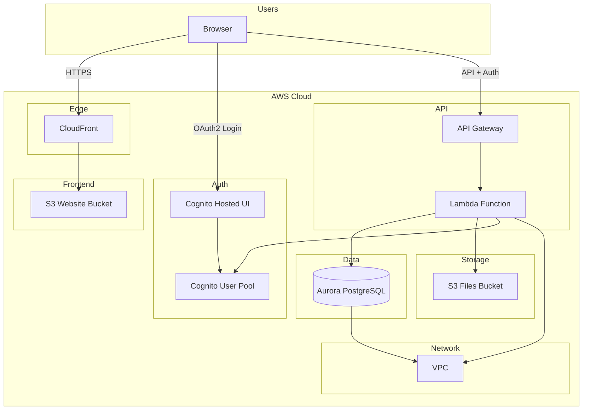
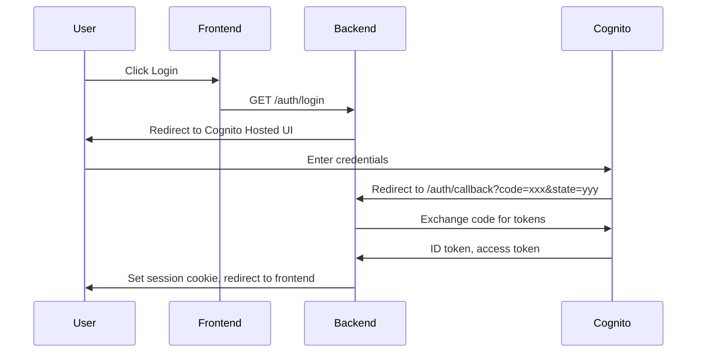

# AWS Cognito Deployment & Local Development Setup

Comprehensive guide for deploying AWS Cognito infrastructure and configuring local development for the LLM Control Plane.

---

## Table of Contents

1. [Overview](#1-overview)
2. [Automated Deployment via GitHub Actions](#2-automated-deployment-via-github-actions)
3. [Infrastructure Assets](#3-infrastructure-assets)
4. [Getting Cognito Credentials](#4-getting-cognito-credentials)
5. [Local Development Setup](#5-local-development-setup)
6. [Creating Test Users](#6-creating-test-users)
7. [Troubleshooting](#7-troubleshooting)
8. [Updating Deployment](#8-updating-deployment)
9. [Cleanup](#9-cleanup)

---

## 1. Overview

### What Gets Deployed

The LLM Control Plane deployment provisions the following AWS resources:

| Component | Description |
|-----------|-------------|
| **Cognito User Pool** | Authentication with Hosted UI, custom branding, self-registration |
| **VPC** | Network infrastructure (10.0.0.0/16 CIDR, 2 availability zones) |
| **Aurora PostgreSQL** | Serverless v2 database for application data |
| **Lambda** | Go API Gateway function (backend) |
| **API Gateway** | HTTP API with custom domain |
| **CloudFront + S3** | Frontend static website hosting |
| **S3 Bucket** | File storage with CORS configuration |

### Architecture Diagram



### OAuth2 Flow



### Environments

| Environment | Trigger | Instance Name | Domain Pattern |
|-------------|---------|---------------|----------------|
| **Sandbox** | Push to `main` branch | `sandbox-llm-cp` | `sandbox.llm-cp.example.com` |
| **RC (Release Candidate)** | Tag `v*rc*` (e.g., `v1.0.0rc1`) | `rc-llm-cp` | `rc.llm-cp.example.com` |

---

## 2. Automated Deployment via GitHub Actions

### Prerequisites

1. **AWS Account** with permissions to create:
   - IAM roles and OIDC identity provider
   - Cognito, VPC, RDS, Lambda, API Gateway, S3, CloudFront, Route53, ACM

2. **GitHub Repository** with Actions enabled

3. **Domain** (optional): For custom domains, configure DNS before deployment

### Setting Up GitHub Secrets

1. Go to **GitHub Repository** → **Settings** → **Secrets and variables** → **Actions**

2. Add the following secrets:

| Secret Name | Description | Required For |
|-------------|-------------|--------------|
| `AWS_ROLE_ARN` | IAM Role ARN for sandbox deployments | Sandbox (push to main) |
| `AWS_ROLE_ARN_PROD` | IAM Role ARN for production/RC deployments | RC (v*rc* tags) |
| `DATADOG_API_KEY` | Datadog APM key (optional) | Both |

### OIDC Configuration for GitHub Actions

1. **Create IAM OIDC Identity Provider** in AWS:
   - Provider URL: `https://token.actions.githubusercontent.com`
   - Audience: `sts.amazonaws.com`

2. **Create IAM Role** with trust policy:

```json
{
  "Version": "2012-10-17",
  "Statement": [
    {
      "Effect": "Allow",
      "Principal": {
        "Federated": "arn:aws:iam::YOUR_ACCOUNT_ID:oidc-provider/token.actions.githubusercontent.com"
      },
      "Action": "sts:AssumeRoleWithWebIdentity",
      "Condition": {
        "StringEquals": {
          "token.actions.githubusercontent.com:aud": "sts.amazonaws.com"
        },
        "StringLike": {
          "token.actions.githubusercontent.com:sub": "repo:YOUR_ORG/llm-control-plane:*"
        }
      }
    }
  ]
}
```

3. **Attach policies** for: Cognito, EC2, VPC, RDS, Lambda, API Gateway, S3, CloudFront, Route53, ACM, Secrets Manager, DynamoDB

4. **Copy the Role ARN** and add as `AWS_ROLE_ARN` (and `AWS_ROLE_ARN_PROD` for production account)

### Triggering Sandbox Deployment

**Automatic:** Push to `main` branch

```powershell
git checkout main
git pull origin main
git push origin main
```

**Manual:** Go to **Actions** → **Deploy Sandbox Environment** → **Run workflow**

Optional: Enable **Reset database** to drop all tables before deployment (use with caution).

### Triggering RC Deployment

**Automatic:** Create and push a tag matching `v*rc*`:

```powershell
git tag v1.0.0rc1
git push origin v1.0.0rc1
```

**Manual:** Go to **Actions** → **Deploy Release Candidate** → **Run workflow**

### Viewing Workflow Outputs (Cognito Credentials)

1. Go to **Actions** → Select the completed workflow run
2. Click on the **deploy** job
3. Expand the **Output deployment information** step
4. Copy the values:

```
--- Cognito ---
User Pool ID: us-east-1_XXXXXXXXX
Client ID: 1234567890abcdefghijklmnop
Domain: https://auth-sandbox-llm-cp.auth.us-east-1.amazoncognito.com

--- For local development ---
COGNITO_USER_POOL_ID=us-east-1_XXXXXXXXX
COGNITO_CLIENT_ID=1234567890abcdefghijklmnop
COGNITO_CLIENT_SECRET=<Get from AWS Console or Secrets Manager>
COGNITO_DOMAIN=https://auth-sandbox-llm-cp.auth.us-east-1.amazoncognito.com
AWS_REGION=us-east-1
```

**Note:** The Client Secret is not output for security. Retrieve it from AWS Console or Secrets Manager (see [Getting Cognito Credentials](#4-getting-cognito-credentials)).

---

## 3. Infrastructure Assets

### Directory Structure

```
infra/
├── sandbox-llm-cp/
│   ├── assets/
│   │   ├── logo.png        # 200x200 px
│   │   ├── favicon.ico     # 32x32 px
│   │   └── background.png  # 1920x1080 px
│   └── cors.json
└── rc-llm-cp/
    ├── assets/
    │   ├── logo.png
    │   ├── favicon.ico
    │   └── background.png
    └── cors.json
```

### Asset Requirements

| Asset | Dimensions | Format | Purpose |
|-------|------------|--------|---------|
| `logo.png` | 200×200 px | PNG | Cognito Hosted UI logo |
| `favicon.ico` | 32×32 px | ICO | Browser tab icon |
| `background.png` | 1920×1080 px | PNG | Login page background |

### Updating CORS Configuration

Edit `infra/sandbox-llm-cp/cors.json` or `infra/rc-llm-cp/cors.json`:

```json
{
  "CORSRules": [
    {
      "AllowedOrigins": [
        "https://sandbox.llm-cp.example.com",
        "https://localhost:5173",
        "https://localhost:3000"
      ],
      "AllowedMethods": ["GET", "POST", "PUT", "DELETE", "HEAD"],
      "AllowedHeaders": ["*"],
      "ExposeHeaders": ["ETag", "Content-Length", "Content-Type"],
      "MaxAgeSeconds": 3600
    }
  ]
}
```

**For local development:** Ensure `https://localhost:5173` (Vite default) is in `AllowedOrigins`. Add `https://localhost:8443` if the frontend proxies to the backend.

### Customizing Cognito Branding

1. Replace assets in `infra/<instance>/assets/`
2. Push changes to trigger redeployment
3. Or update via AWS Console: **Cognito** → **User Pools** → **App integration** → **Hosted UI** → **Customize**

---

## 4. Getting Cognito Credentials

### From GitHub Actions Workflow Outputs

After a successful deployment:

1. Open the workflow run → **deploy** job
2. Expand **Output deployment information**
3. Copy `COGNITO_USER_POOL_ID`, `COGNITO_CLIENT_ID`, `COGNITO_DOMAIN`
4. Get `COGNITO_CLIENT_SECRET` from AWS Console (see below)

### From AWS Console (Detailed Steps)

1. **Navigate to Cognito:**
   - AWS Console → **Cognito** → **User pools**
   - Select pool: `auth-sandbox-llm-cp` or `auth-rc-llm-cp`

2. **Get User Pool ID:**
   - On the pool overview page, copy **User pool ID** (e.g., `us-east-1_ABC123XYZ`)

3. **Get Client ID and Secret:**
   - Go to **App integration** tab
   - Under **App client list**, click the app client name
   - Copy **Client ID**
   - Click **Show client secret** → Copy **Client secret**

4. **Get Cognito Domain:**
   - **App integration** → **Domain name** section
   - Copy the domain (e.g., `https://auth-sandbox-llm-cp.auth.us-east-1.amazoncognito.com`)

### Using Helper Script (PowerShell)

If `scripts/get-cognito-info.ps1` exists:

```powershell
.\scripts\get-cognito-info.ps1 -UserPoolId "us-east-1_XXXXXXXXX" -Region "us-east-1"
```

**Expected output:**
```
User Pool ID:     us-east-1_XXXXXXXXX
Client ID:        1234567890abcdefghijklmnop
Client Secret:    (retrieved from Secrets Manager or Console)
Domain:           https://auth-sandbox-llm-cp.auth.us-east-1.amazoncognito.com
```

**Note:** Create this script to automate retrieval via AWS CLI. Example implementation:

```powershell
# scripts/get-cognito-info.ps1 (example)
param(
    [Parameter(Mandatory=$true)] [string]$UserPoolId,
    [string]$Region = "us-east-1"
)
$client = aws cognito-idp describe-user-pool-client `
    --user-pool-id $UserPoolId `
    --client-id (aws cognito-idp list-user-pool-clients --user-pool-id $UserPoolId --query 'UserPoolClients[0].ClientId' --output text) `
    --region $Region
# Output client ID, secret (if available), domain
```

---

## 5. Local Development Setup

### Prerequisites

| Tool | Version | Purpose |
|------|---------|---------|
| **Go** | 1.24+ | Backend runtime |
| **Docker Desktop** | Latest | PostgreSQL |
| **OpenSSL** | Any | HTTPS certificate generation |
| **AWS CLI** | 2.x+ | Optional, for Cognito management |
| **Node.js** | 20+ | Frontend (Vite) |
| **Make** | 3.x+ | Build automation |
| **PowerShell** | 7+ | Certificate generation script |

### Initial Setup Steps

1. **Clone and install dependencies:**

```powershell
git clone https://github.com/your-org/llm-control-plane.git
cd llm-control-plane
make setup
```

2. **Copy environment file:**

```powershell
Copy-Item backend\.env.example backend\.env
```

3. **Configure Cognito credentials in `backend/.env`:**

```env
# AWS Cognito (from deployment)
COGNITO_USER_POOL_ID=us-east-1_XXXXXXXXX
COGNITO_CLIENT_ID=1234567890abcdefghijklmnop
COGNITO_CLIENT_SECRET=your-client-secret-here
COGNITO_DOMAIN=https://auth-sandbox-llm-cp.auth.us-east-1.amazoncognito.com
AWS_REGION=us-east-1

# OAuth2 callback (must match Cognito callback URLs)
COGNITO_REDIRECT_URI=https://localhost:8443/auth/callback

# Frontend URL (for CORS)
FRONT_END_URL=https://localhost:5173

# TLS (required for Cognito OAuth2)
TLS_ENABLED=true
TLS_CERT_FILE=certs/cert.pem
TLS_KEY_FILE=certs/key.pem
PORT=8443
```

### Generating HTTPS Certificates

Cognito requires HTTPS for OAuth2 callbacks. Generate self-signed certs:

```powershell
make certs
```

Or manually:

```powershell
pwsh -ExecutionPolicy Bypass -File scripts/generate-certs.ps1
```

**Expected output:**
```
Generating HTTPS certificates for local development...
✓ Certificates generated successfully!
Certificate: certs/cert.pem
Private Key: certs/key.pem
Valid for: 365 days
```

### Trusting Self-Signed Certificates in Browser

1. Open `https://localhost:8443` in your browser
2. You will see a security warning (e.g., "Your connection is not private")
3. Click **Advanced** → **Proceed to localhost (unsafe)** or equivalent
4. The certificate is now trusted for this session

**Chrome:** Type `thisisunsafe` when the warning appears (no input box) to bypass.

**Firefox:** Advanced → Accept the Risk and Continue.

### Starting Development Servers

```powershell
make dev
```

**Expected output:**
```
→ Starting development environment...
Backend (HTTPS): https://localhost:8443
Frontend:        https://localhost:5173
Auth Login:      https://localhost:8443/auth/login

Note: Accept self-signed certificate warnings in your browser
Press Ctrl+C to stop both servers
```

### Testing OAuth2 Flow

1. Open `https://localhost:5173` (or `https://localhost:8443/auth/login`)
2. Click **Login**
3. You are redirected to Cognito Hosted UI
4. Sign in with a test user (or create one)
5. Cognito redirects to `https://localhost:8443/auth/callback`
6. Backend exchanges code for tokens, sets session cookie
7. You are redirected back to the frontend, authenticated

**Verify:** Check that `https://localhost:8443/auth/callback` is in your Cognito App Client's **Callback URL(s)** (deployed workflows include it by default).

---

## 6. Creating Test Users

### Using Helper Script (PowerShell)

If `scripts/create-test-user.ps1` exists:

```powershell
.\scripts\create-test-user.ps1 `
    -UserPoolId "us-east-1_XXXXXXXXX" `
    -Email "dev@example.com" `
    -Password "TempPass123!" `
    -OrgId "550e8400-e29b-41d4-a716-446655440000" `
    -AppId "550e8400-e29b-41d4-a716-446655440001" `
    -Role "developer"
```

### Using AWS Console

1. **Cognito** → **User pools** → Select your pool
2. **Users** tab → **Create user**
3. **User name:** (leave blank for email sign-in)
4. **Email address:** `dev@example.com`
5. **Temporary password:** Set and mark "Send an email to get the new password" or "Set password"
6. **Custom attributes** (from actions-aws-auth schema): Add:
   - `custom:tenantId` = UUID of your organization (e.g., `550e8400-e29b-41d4-a716-446655440000`)
   - `custom:userRole` = `admin` | `developer` | `user` | `viewer`
   - `custom:app_id` = optional; not in actions-aws-auth schema (omit unless added to pool)

**Note:** actions-aws-auth creates `tenantId`, `userRole`, `apiKey`, `tenantTier`, `serviceProviderId`. The backend maps `tenantId`→OrgID, `userRole`→Role.

### Using AWS CLI Directly

```powershell
aws cognito-idp admin-create-user `
    --user-pool-id us-east-1_XXXXXXXXX `
    --username "dev@example.com" `
    --user-attributes `
        Name=email,Value=dev@example.com `
        Name=email_verified,Value=true `
        Name=custom:tenantId,Value=550e8400-e29b-41d4-a716-446655440000 `
        Name=custom:userRole,Value=developer `
    --temporary-password "TempPass123!" `
    --message-action SUPPRESS `
    --region us-east-1
```

### Custom Attribute Values (actions-aws-auth schema)

| Attribute | Required | Format | Example |
|-----------|----------|--------|---------|
| `custom:tenantId` | Yes | UUID | `550e8400-e29b-41d4-a716-446655440000` |
| `custom:userRole` | Yes | Enum | `admin`, `developer`, `user`, `viewer` |
| `custom:app_id` | No | UUID | Not in actions-aws-auth; omit unless added to pool |

### Logging In with Test User

1. Go to `https://localhost:8443/auth/login`
2. Enter email and password
3. If temporary password: Cognito will prompt for a new password
4. After successful login, you are redirected to the frontend with a session

---

## 7. Troubleshooting

### Certificate Trust Issues

**Symptom:** Browser blocks `https://localhost:8443` with "Connection not private"

**Solutions:**
1. Accept the warning: **Advanced** → **Proceed to localhost**
2. Regenerate certs: `make certs` (delete `certs/` first if needed)
3. Ensure OpenSSL is installed: `openssl version`
4. On Windows: Install OpenSSL via [Win32 OpenSSL](https://slproweb.com/products/Win32OpenSSL.html) or `choco install openssl`

### OAuth Redirect Mismatches

**Symptom:** "redirect_uri_mismatch" or "Invalid redirect URI"

**Cause:** Callback URL must match exactly. Cognito allows:
- `https://api.sandbox.llm-cp.example.com/auth/callback`
- `https://localhost:8443/auth/callback`

**Solutions:**
1. Ensure `COGNITO_REDIRECT_URI=https://localhost:8443/auth/callback` in `backend/.env`
2. No trailing slash
3. Use `https`, not `http`
4. Redeploy if you changed domains; the workflow configures Cognito callback URLs

### CORS Errors

**Symptom:** "Access-Control-Allow-Origin" errors when frontend calls API

**Solutions:**
1. Add your frontend origin to `infra/sandbox-llm-cp/cors.json`:
   ```json
   "AllowedOrigins": ["https://localhost:5173", "https://localhost:8443"]
   ```
2. Redeploy to apply CORS changes
3. For local dev, ensure `FRONT_END_URL` in `.env` matches your frontend URL

### Token Validation Failures

**Symptom:** `failed to validate JWT: unable to verify token`

**Solutions:**
1. Verify `COGNITO_USER_POOL_ID`, `COGNITO_CLIENT_ID`, `COGNITO_DOMAIN` in `.env`
2. Ensure token is not expired (default 1 hour)
3. Check `AWS_REGION` matches your User Pool region
4. Enable debug logging: `LOG_LEVEL=debug` in `.env`

### "Invalid state" Errors (CSRF Protection)

**Symptom:** "Invalid state parameter" after Cognito redirect

**Cause:** State cookie lost (e.g., cross-origin, cookie not set)

**Solutions:**
1. Use same domain for frontend and backend during dev, or ensure cookies are set correctly
2. Clear browser cookies and try again
3. Ensure `FRONT_END_URL` and callback URL use `https`

### Workflow Failures

**Symptom:** GitHub Actions deployment fails

**Solutions:**
1. **Check logs:** Actions → Failed run → Expand failed step
2. **AWS permissions:** Ensure IAM role has required permissions (Cognito, VPC, RDS, Lambda, etc.)
3. **OIDC trust:** Verify `token.actions.githubusercontent.com` OIDC provider and role trust policy
4. **Secrets:** Ensure `AWS_ROLE_ARN` (and `AWS_ROLE_ARN_PROD` for RC) are set
5. **Domain/Route53:** If using custom domains, ensure DNS is configured; or use placeholder domains for testing

---

## 8. Updating Deployment

### Changing Domains

1. Edit `.github/workflows/on-push.yml` (sandbox) or `.github/workflows/on-tags-rc.yml` (RC):
   ```yaml
   web_domain: your-actual-domain.com
   api_domain: api.your-actual-domain.com
   ```
2. Configure DNS (Route53 or your provider) to point to the deployed resources
3. Push to `main` or create a new RC tag

### Updating Cognito Configuration

1. Edit `.github/workflows/infra.yml`:
   - `callback_urls`: Add/remove callback URLs
   - `logout_urls`: Add/remove logout URLs
   - `login_position`: `CENTER` or `END`
   - `self_registration`: `'true'` or `'false'`
2. Push changes to trigger redeployment

### Rotating Secrets

1. **Client Secret:** Create new app client in Cognito, update Lambda env vars, then delete old client
2. **Database:** Aurora credentials are in Secrets Manager; rotate via AWS Console
3. **GitHub Secrets:** Update `AWS_ROLE_ARN` / `AWS_ROLE_ARN_PROD` in repo settings

### Database Migrations via Workflow

Migrations run automatically during deployment. To reset the database:

1. **Manual workflow run:** Actions → Deploy Sandbox/RC → Run workflow
2. Check **Reset database** (⚠️ Drops all tables)
3. Run workflow

---

## 9. Cleanup

### Destroying Sandbox Environment

The deployment uses Terraform via GitHub Actions. To destroy:

1. Use the Terraform backend (if you have access): Run `terraform destroy` in the appropriate directory
2. Or manually delete AWS resources:
   - Cognito User Pool: `auth-sandbox-llm-cp`
   - Lambda: `llm-cp-sandbox-llm-cp`
   - API Gateway, CloudFront, S3 buckets, Aurora cluster, VPC
3. Clean up S3 Terraform state bucket: `llm-cp-sandbox-llm-cp` (or similar)

### Destroying RC Environment

Same as sandbox, but for `rc-llm-cp` resources:

- Cognito: `auth-rc-llm-cp`
- Lambda: `llm-cp-rc-llm-cp`
- etc.

### Cleaning Up AWS Resources

**Order of deletion (to avoid dependency failures):**
1. API Gateway
2. Lambda
3. CloudFront distribution
4. S3 buckets (website, files)
5. Cognito User Pool
6. Aurora cluster
7. VPC (after detaching/destroying dependent resources)
8. S3 backend bucket (Terraform state)
9. DynamoDB lock table (if used)

---

## Related Documentation

- [Local Development Guide](LOCAL_DEVELOPMENT.md) – Full local setup, database, testing
- [Architecture](../approach/ARCHITECTURE-tsum.md) – System design and patterns
- [Backend Architecture Analysis](../approach/BACKEND_ARCHITECTURE_ANALYSIS.md) – Service structure

---

**Last updated:** February 2025
